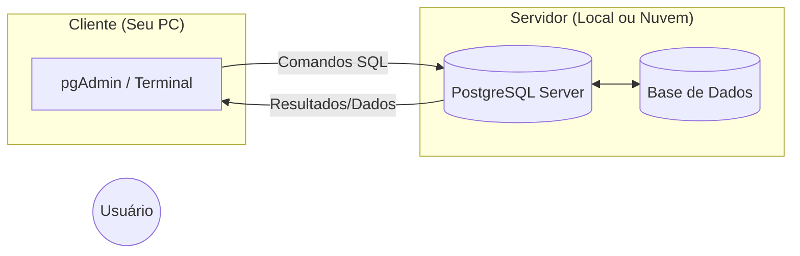

# Aula 01 - Introdução a Bancos de Dados 🗄️

!!! tip "Objetivo"
    **Objetivo**: Compreender os conceitos fundamentais de dados e informação, explorar a evolução histórica do armazenamento de dados e entender a arquitetura básica de um Sistema Gerenciador de Banco de Dados Relacional (SGBDR).

---

## 1. Dado, Informação e Banco de Dados 🧩

Antes de começarmos a digitar comandos, precisamos entender o que estamos manipulando.

*   **Dado**: É um elemento bruto, sem contexto (ex: "35", "João", "2024-05-10"). Sozinho, ele não transmite uma mensagem clara.
*   **Informação**: É o dado processado e contextualizado (ex: "A temperatura média hoje é 35°C").
*   **Banco de Dados**: É uma coleção organizada de dados relacionados, estruturados de forma que possam ser acessados, gerenciados e atualizados facilmente.

---

## 2. Evolução dos Bancos de Dados ⏳

A forma como guardamos informações mudou drasticamente ao longo das décadas:

1.  **Arquivos Planos (Flat Files)**: Dados guardados em arquivos de texto simples (.txt, .csv). Difícil de buscar e sem segurança.
2.  **Modelo Hierárquico e em Rede**: Estruturas rígidas em forma de árvore.
3.  **Modelo Relacional (Anos 70)**: Introduzido por Edgar F. Codd, organiza dados em tabelas (linhas e colunas). É o padrão mais utilizado até hoje.
4.  **NoSQL (Anos 2000)**: Surgiu para lidar com grandes volumes de dados não estruturados e alta escalabilidade.

---

## 3. O Modelo Relacional e SGBDR 🏛️

Um **SGBDR** (Sistema Gerenciador de Banco de Dados Relacional) é o software que permite interagir com o banco de dados.

### Exemplos Populares:
*   🐘 **PostgreSQL**: O foco deste curso. Poderoso, robusto e código aberto.
*   🐬 **MySQL**: Muito popular para aplicações web simples.
*   🪟 **SQL Server**: A solução corporativa da Microsoft.
*   🅾️ **Oracle**: O gigante do mercado para grandes corporações.

### Arquitetura Cliente/Servidor
O banco de dados geralmente roda em um **Servidor**. Nós, como desenvolvedores, usamos um **Cliente** (como pgAdmin ou terminal) para enviar comandos e receber resultados.

---

## 4. Visualização de Arquitetura (Mermaid) 📊



---

## 5. Prática: Primeiros Passos com PostgreSQL 💻

Vamos verificar se o seu ambiente está pronto. Se ainda não instalou, veja o guia de [Setup 01](../setups/setup-01.md).

### Verificando via Terminal

```termynal
$ psql --version
psql (PostgreSQL) 16.2

$ psql -U postgres
Password for user postgres: ********
postgres=# \l (Listar bancos de dados)
postgres=# \q (Sair)
```

> [!IMPORTANT]
> A senha definida na instalação é a chave mestra para o seu banco. Não a perca!

---

## 6. Mini-Projeto: Planejando seu Primeiro Banco 🚀

Imagine que você vai criar um sistema para uma **Biblioteca**. 
Quais "coisas" (entidades) você precisaria guardar?

1.  Livros (Título, Autor, ISBN)
2.  Usuários (Nome, CPF, E-mail)
3.  Empréstimos (Data, Prazo)

> **Desafio**: Tente desenhar em papel ou numa ferramenta simples como essas informações se conectam.

---

## 7. Exercícios de Fixação 🧠

1.  Diferencie dado de informação com um exemplo do seu cotidiano.
2.  Por que o Modelo Relacional é chamado de "relacional"?
3.  Cite três vantagens de usar um SGBD em vez de guardar dados em arquivos de texto (.txt).

---

**Próxima Aula**: Vamos aprender a desenhar bancos de dados com o [Modelo E-R](./aula-02.md)! 🏗️
