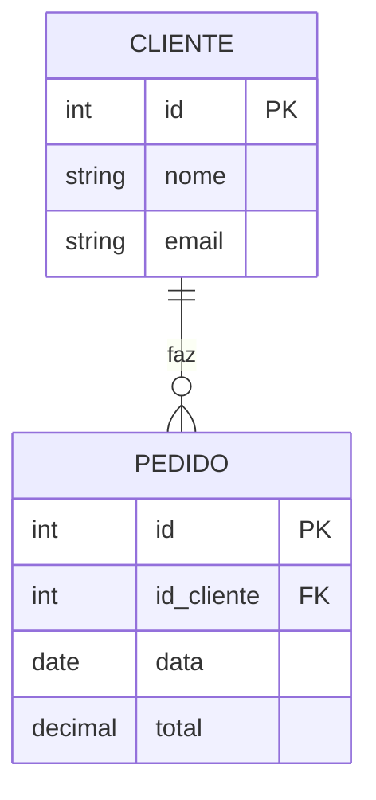

# Aula 02 - Modelagem de Dados e Modelo E-R 🏗️

!!! tip "Objetivo"
    **Objetivo**: Aprender a abstrair a realidade para o mundo dos dados, utilizando o Modelo Entidade-Relacionamento (E-R) para projetar estruturas de bancos de dados eficientes e consistentes.

---

## 1. Abstração e Modelagem 🧠

Modelar dados é como desenhar a planta de uma casa antes de construí-la. Precisamos definir quem são os personagens e como eles interagem.

*   **Entidade**: É um "objeto" do mundo real sobre o qual queremos guardar dados (ex: Cliente, Produto, Pedido).
*   **Atributo**: São as características de uma entidade (ex: Nome, Preço, Cor).
*   **Relacionamento**: É como as entidades se conectam (ex: Um Cliente **faz** um Pedido).

---

## 2. Atributos e Chaves 🔑

Para que um banco de dados funcione, cada registro deve ser único e identificável.

### Chave Primária (Primary Key - PK)
É o atributo (ou conjunto de atributos) que identifica exclusivamente cada linha de uma tabela.
*   **Exemplo**: O CPF de um usuário ou um ID autoincrementado.

### Chave Estrangeira (Foreign Key - FK)
É um atributo que estabelece um vínculo entre duas tabelas, apontando para a PK de outra tabela.
*   **Exemplo**: Na tabela `Pedidos`, guardamos o `id_cliente` para saber quem comprou.

---

## 3. Cardinalidade: O "Pulo do Gato" 🐈

A cardinalidade define quantos itens de uma entidade podem se relacionar com quantos itens de outra.

*   **1:1 (Um para Um)**: Um usuário tem um perfil.
*   **1:N (Um para Muitos)**: Um cliente faz vários pedidos. { .fragment }
*   **N:N (Muitos para Muitos)**: Vários alunos se matriculam em várias disciplinas. { .fragment }

> [!NOTE]
> Em relacionamentos N:N, geralmente precisamos de uma **tabela associativa** (tabela do meio).

---

## 4. Integridade Referencial 🛡️

O banco de dados garante que os relacionamentos sejam válidos. Se um Pedido aponta para o Cliente ID 50, o Cliente 50 **deve existir**. O SGBD impede que você apague o cliente se ele tiver pedidos pendentes.

---

## 5. Diagrama E-R (Mermaid) 📊

Vamos visualizar o relacionamento entre Clientes e Pedidos:



---

## 6. Ferramentas CASE 🛠️

Para criar diagramas profissionais, usamos ferramentas como:
*   [dbdiagram.io](https://dbdiagram.io/): Rápido e baseado em texto.
*   **brModelo**: Clássico acadêmico brasileiro.
*   **MySQL Workbench**: Visual e completo.

---

## 7. Prática: Desenhando um Mini-Sistema 💻

Use o terminal ou um papel para listar os atributos e chaves do sistema de uma **Clínica Médica**:

```termynal
$ Entidades sugeridas:
$ - Medico (CRM, Nome, Especialidade)
$ - Paciente (CPF, Nome, Telefone)
$ - Consulta (Data, Hora, Medico_ID, Paciente_ID)
```

---

## 8. Exercícios de Fixação 🧠

1.  O que acontece se tentarmos inserir um `id_cliente` na tabela de `Pedidos` que não existe na tabela `Clientes`?
2.  Explique a diferença entre uma Chave Primária Simples e uma Chave Primária Composta.
3.  Desenhe (ou descreva) o relacionamento entre **Autor** e **Livro**. Qual a cardinalidade?

---

**Próxima Aula**: Vamos aprender a organizar a "bagunça" com a [Normalização](./aula-03.md)! 📡
