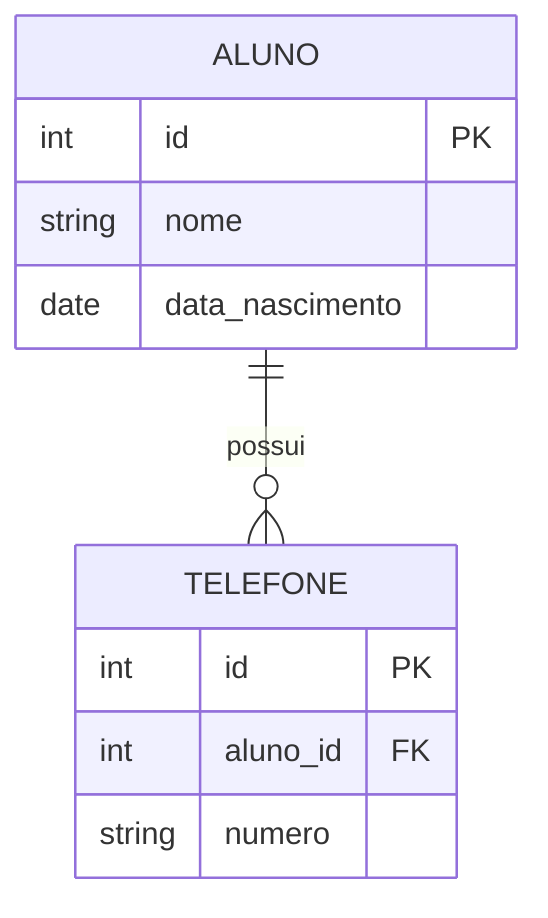

# Aula 03 - Normalização e Estrutura Relacional 📡

!!! tip "Objetivo"
    **Objetivo**: Aprender as regras da Normalização para eliminar redundâncias, garantir a integridade dos dados e criar estruturas de tabelas otimizadas e profissionais.

---

## 1. Tipos de Dados e o Conceito de NULL 🧩

Cada coluna em uma tabela deve ter um tipo definido. Isso ajuda o SGBD a economizar espaço e validar entradas.

*   **Inteiros (`INT`, `BIGINT`)**: Números sem casas decimais.
*   **Decimais (`DECIMAL`, `NUMERIC`, `REAL`)**: Para valores monetários ou medidas precisas.
*   **Texto (`VARCHAR`, `TEXT`, `CHAR`)**: Cadeias de caracteres.
*   **Data/Hora (`DATE`, `TIMESTAMP`)**: Registros temporais.
*   **NULL**: Representa a **ausência de valor** ou valor desconhecido. Não é o mesmo que zero ou string vazia ("").

---

## 2. O que é Normalização? ⚖️

É um processo técnico de organizar as colunas e tabelas de um banco de dados para minimizar a redundância (repetição de dados) e evitar anomalias de atualização.

### Por que normalizar?
*   Economia de espaço em disco.
*   Facilidade de manutenção.
*   Garantia de que a informação esteja em um só lugar.

---

## 3. As Formas Normais (FN) 📏

Existem várias formas normais, mas as três primeiras (1FN, 2FN e 3FN) são as mais essenciais no dia a dia.

### 1ª Forma Normal (1FN) - Atomicidade
*   Cada coluna deve conter apenas **um valor** (valores atômicos).
*   Não pode haver grupos repetidos ou listas separadas por vírgula em uma célula.
*   *Exemplo*: `Telefones: (11) 9999, (11) 8888` ❌ -> Criar tabela separada para telefones ✅.

### 2ª Forma Normal (2FN) - Dependência Funcional
*   Estar na 1FN.
*   Toda coluna que não é chave deve depender da **chave primária inteira** (relevante para chaves compostas).

### 3ª Forma Normal (3FN) - Dependência Transitiva
*   Estar na 2FN.
*   As colunas não-chave não podem depender de outras colunas não-chave.
*   *Exemplo*: Tabela `Pedidos` com `id_cliente` e `nome_cliente`. O nome depende do ID, não do Pedido. Deve sair dali.

---

## 4. Especialização e Generalização 🧬

Conceitos herdados da Orientação a Objetos:
*   **Generalização**: Criar uma entidade "Pai" (ex: `Pessoa`).
*   **Especialização**: Criar entidades "Filhas" com atributos específicos (ex: `Pessoa_Fisica` e `Pessoa_Juridica`).

---

## 5. Visualização de Estrutura (Mermaid) 📊

Abaixo, um exemplo de banco normalizado:



---

## 6. Prática: Corrigindo uma Tabela Ruim 💻

Observe esta estrutura mal feita:
`Vendas (id_venda, data, cliente_nome, produto_nome, produto_preco)`

```termynal
$ Problemas identificados:
$ 1. Nome do cliente repetido em cada venda (redundância).
$ 2. Se o preço do produto mudar, o histórico das vendas pode se perder.
$ 
$ Solução Normalizada:
$ - Tabelas separadas para: Clientes, Produtos e Vendas.
```

---

## 7. Exercícios de Fixação 🧠

1.  Explique a frase: "A 3ª Forma Normal combate a dependência transitiva".
2.  Quando é aceitável realizar a **Desnormalização** de um banco de dados?
3.  O que é um valor **Atômico**?

---

**Próxima Aula**: Vamos colocar a mão na massa com os comandos de [DDL - Criação da Estrutura](./aula-04.md)! 🏗️
