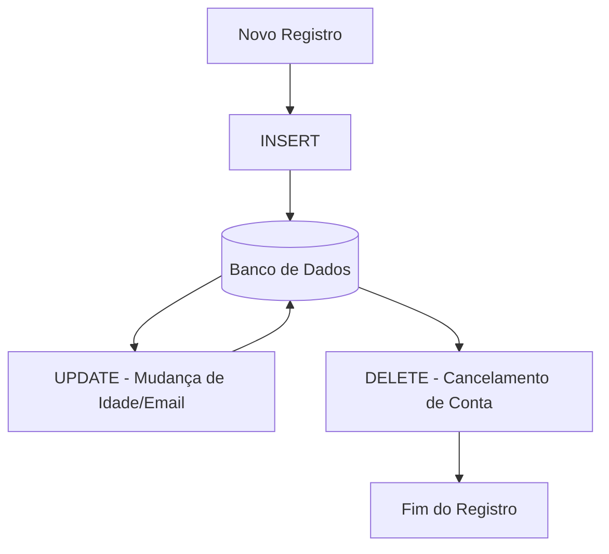

# Aula 05 - DML (Manipulação de Dados) ⚙️

!!! tip "Objetivo"
    **Objetivo**: Aprender os comandos DML (Data Manipulation Language) para inserir, atualizar e excluir informações dentro das tabelas criadas no PostgreSQL.

---

## 1. O que é DML? 🖊️

Enquanto o DDL cria o "balde", o **DML** gerencia a "água" (os dados). É o conjunto de comandos que usamos no dia a dia para manter as informações do sistema atualizadas.

Comandos principais:
*   `INSERT`: Adiciona novas linhas.
*   `UPDATE`: Altera dados de linhas existentes.
*   `DELETE`: Remove linhas da tabela.

---

## 2. Inserindo Dados (INSERT) 📥

O comando `INSERT` adiciona um novo registro.

### Sintaxe Básica:
```sql
INSERT INTO alunos (nome, email) 
VALUES ('Ricardo Pires', 'ricardo@email.com');
```

### Inserindo Múltiplos Registros de uma vez:
```sql
INSERT INTO alunos (nome, email) VALUES 
('Ana Souza', 'ana@email.com'),
('João Silva', 'joao@email.com'),
('Maria Oliveira', 'maria@email.com');
```

> [!TIP]
> Não é necessário incluir a coluna `id` se ela for do tipo `SERIAL`, pois o banco a preenche sozinho!

---

## 3. Atualizando Dados (UPDATE) ✏️

Use o `UPDATE` para mudar informações que já estão lá.

```sql
UPDATE alunos 
SET email = 'ricardo.novo@email.com' 
WHERE id = 1;
```

> [!CAUTION]
> **NUNCA esqueça o `WHERE`!** Sem ele, você atualizará **TODOS** os registros da tabela com o mesmo valor.

---

## 4. Removendo Dados (DELETE) 🗑️

O `DELETE` remove registros permanentemente.

```sql
DELETE FROM alunos 
WHERE id = 3;
```

> [!CAUTION]
> Assim como no `UPDATE`, o `WHERE` é vital. Se esquecer, você esvaziará a tabela inteira! Para apagar tudo propositalmente e de forma rápida, dê preferência ao `TRUNCATE` (DDL).

---

## 5. Visualização de Fluxo (Mermaid) 📊



---

## 6. Prática: Populando seu Banco 💻

Utilize o Query Tool para popular sua tabela de alunos:

```termynal
$ INSERT INTO alunos (nome) VALUES ('Cadu'), ('Bia');
$ SELECT * FROM alunos;
$ 
$ -- Simulando erro do estagiário:
$ UPDATE alunos SET nome = 'ERRO'; -- Cuidado! Cancele antes de executar!
```

---

## 7. Mini-Projeto: Gestão de Inventário 🚀

Crie uma tabela `produtos` (id, nome, preco, estoque) e realize:
1.  O cadastro de 3 produtos.
2.  Uma atualização de preço em 10% para um produto específico.
3.  A exclusão de um produto que saiu de linha.

---

## 8. Exercícios de Fixação 🧠

1.  Diferencie `UPDATE` de `INSERT`.
2.  O que acontece se eu executar `DELETE FROM alunos;` sem a cláusula `WHERE`?
3.  Como insiro um valor na coluna `data_nascimento` seguindo o formato padrão do ISO (YYYY-MM-DD)?

---

**Próxima Aula**: Vamos aprender a recuperar esses dados com o [DQL Básico](../aulas/aula-06.md)! 💾