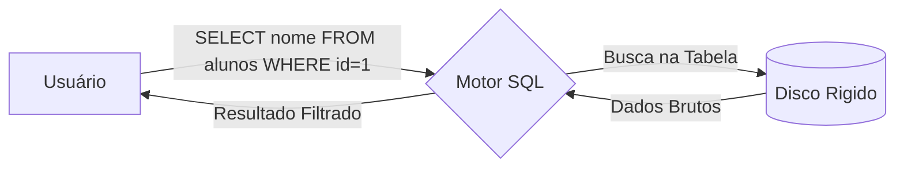

# Aula 06 - DQL Básico 💾

!!! tip "Objetivo"
    **Objetivo**: Dominar o comando SELECT para recuperar informações de tabelas, aprendendo a filtrar resultados com WHERE e organizar a exibição com ORDER BY.

---

## 1. O que é DQL? 🔍

**DQL** (Data Query Language) é o subconjunto do SQL focado na recuperação de dados. É, sem dúvida, o comando que você mais usará em toda a sua carreira na computação.

O comando principal é o **SELECT**.

---

## 2. SELECT: Projeção e Seleção 🎥

### Projeção (Escolhendo Colunas)
Quando você escolhe quais colunas quer ver.
```sql
SELECT nome, email FROM alunos;
```

### Seleção (Escolhendo Linhas)
Quando você filtra quais registros devem aparecer usando o `WHERE`.
```sql
SELECT * FROM alunos WHERE id = 1;
```

> [!NOTE]
> O asterisco (`*`) significa "todas as colunas". Use-o com moderação em bancos de dados muito grandes por questões de performance.

---

## 3. Filtrando com WHERE 🎯

O `WHERE` aceita diversos operadores de comparação:

| Operador | Significado |
| :--- | :--- |
| `=` | Igual |
| `<>` ou `!=` | Diferente |
| `>` e `<` | Maior e Menor |
| `>=` e `<=` | Maior/Menor ou Igual |
| `BETWEEN` | Entre dois valores (ex: `BETWEEN 10 AND 20`) |
| `LIKE` | Busca por padrão de texto (ex: `nome LIKE 'Ri%'`) |
| `IN` | Verifica se o valor está em uma lista (ex: `id IN (1, 2, 5)`) |

---

## 4. Ordenando Resultados (ORDER BY) 📶

Por padrão, o banco de dados não garante a ordem dos registros. Use o `ORDER BY` para organizar.

*   **ASC**: Ordem Ascendente (padrão).
*   **DESC**: Ordem Descendente.

```sql
SELECT nome, preco FROM produtos 
ORDER BY preco DESC; -- Do mais caro para o mais barato
```

---

## 5. Visualização de Execução (Mermaid) 📊



---

## 6. Prática: Consultas Simples 💻

Abra o terminal e tente realizar estas buscas:

```termynal
$ SELECT * FROM alunos WHERE nome LIKE 'A%'; -- Nomes que começam com A
$ SELECT nome, data_contratacao FROM professores ORDER BY data_contratacao ASC;
$ SELECT * FROM produtos WHERE preco > 100 AND estoque < 5;
```

---

## 7. Mini-Projeto: Dashboard de Vendas 🚀

Utilizando sua tabela de `produtos`, crie consultas para:
1.  Listar todos os produtos com estoque zerado.
2.  Listar o nome e o preço dos 5 produtos mais baratos.
3.  Buscar produtos que tenham a palavra "Monitor" no nome.

---

## 8. Exercícios de Fixação 🧠

1.  O que faz a cláusula `DISTINCT` em um comando SELECT?
2.  Como eu buscaria todos os alunos que nasceram entre os anos 2000 e 2005 usando o operador `BETWEEN`?
3.  Qual a diferença entre usar `ORDER BY 1` e `ORDER BY nome_coluna`?

---

**Próxima Aula**: Vamos subir de nível com as [Consultas Avançadas e Agregações](../aulas/aula-07.md)! 🧪