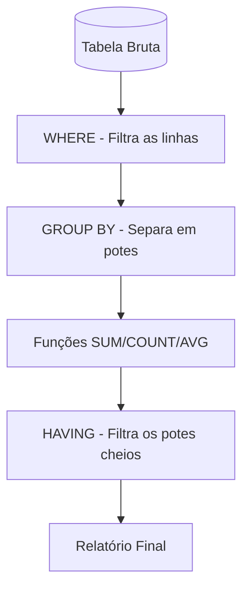

# Aula 07 - Consultas Avançadas e Agregações 🧪

!!! tip "Objetivo"
    **Objetivo**: Aprender a realizar cálculos diretamente no banco de dados usando funções de agregação, agrupando dados com GROUP BY e filtrando esses grupos com HAVING.

---

## 1. Funções de Agregação 🧮

Em vez de trazer todas as linhas, às vezes precisamos de um **resumo** (total, média, contagem).

As 5 funções básicas de agregação são:
*   `COUNT()`: Conta o número de linhas ou valores.
*   `SUM()`: Soma valores numéricos.
*   `AVG()`: Calcula a média aritmética.
*   `MAX()`: Encontra o maior valor.
*   `MIN()`: Encontra o menor valor.

```sql
SELECT COUNT(*) FROM alunos; -- Quantos alunos existem?
SELECT SUM(preco) FROM produtos; -- Valor total do estoque em R$.
```

---

## 2. Apelidos (ALIAS) com AS 🏷️

Para deixar o cabeçalho do relatório mais bonito e legível, usamos o `AS`.

```sql
SELECT AVG(nota) AS media_da_turma FROM provas;
```

---

## 3. Agrupando Dados (GROUP BY) 🧱

O `GROUP BY` divide o resultado em grupos para que possamos aplicar as funções de agregação em cada pedaço.

```sql
-- Quantos produtos existem em cada categoria?
SELECT categoria, COUNT(*) AS total_itens 
FROM produtos 
GROUP BY categoria;
```

---

## 4. Filtrando Grupos com HAVING 🎯

Se o `WHERE` filtra as **linhas** (antes do grupo), o `HAVING` filtra os **grupos** (depois que a conta foi feita).

```sql
-- Quais categorias têm mais de 50 produtos cadastrados?
SELECT categoria, COUNT(*) 
FROM produtos 
GROUP BY categoria 
HAVING COUNT(*) > 50;
```

---

## 5. Visualização de Processamento (Mermaid) 📊



---

## 6. Prática: Relatórios de Alunos 💻

Imagine uma tabela `notas` (aluno_id, disciplina, nota). Tente:

```termynal
$ SELECT disciplina, AVG(nota) AS media FROM notas GROUP BY disciplina;
$ SELECT aluno_id, SUM(valor_pago) AS total_investido FROM mensalidades GROUP BY aluno_id;
$ SELECT MAX(preco) AS mais_caro FROM produtos;
```

---

## 7. Mini-Projeto: Dashboard de Vendas 🚀

Baseado em um sistema de mercado:
1.  Calcule o faturamento total (soma) de um dia específico.
2.  Mostre qual o produto mais caro e o mais barato da loja.
3.  Liste as categorias que geraram mais de R$ 5.000,00 em vendas.

---

## 8. Exercícios de Fixação 🧠

1.  Qual a diferença fundamental entre `WHERE` e `HAVING`?
2.  O que acontece se eu usar uma função de agregação (como `SUM`) sem usar o `GROUP BY`?
3.  Como eu contaria apenas os valores únicos em uma coluna (ex: quantos estados diferentes meus alunos moram)?

---

**Próxima Aula**: Vamos aprender a unir o que está separado com os [JOINs - Junções entre Tabelas](../aulas/aula-08.md)! 🔗