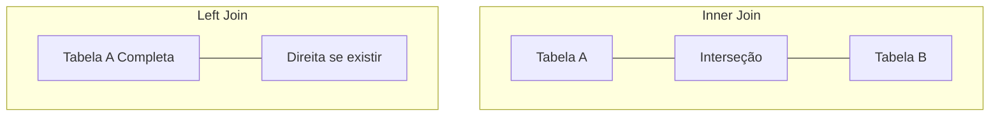

# Aula 08 - JOINs: Junções entre Tabelas 🔗

!!! tip "Objetivo"
    **Objetivo**: Aprender a conectar tabelas separadas para extrair informações completas, dominando os diferentes tipos de JOIN (Inner, Left, Right e Full) e entendendo como o banco de dados relaciona as chaves.

---

## 1. O que são JOINs? 🤝

Em um banco de dados normalizado, os dados estão espalhados em várias tabelas. O **JOIN** é a "ponte" que nos permite unir essas peças para gerar uma resposta legível.

Imagine que você tem o `id_cliente` no pedido, mas quer ver o **nome** do cliente. Você precisa unir a tabela de Pedidos com a de Clientes.

---

## 2. INNER JOIN: A Interseção 🎯

É o tipo mais comum. Ele retorna apenas os registros que possuem correspondência em **ambas** as tabelas.

```sql
SELECT pedidos.id, clientes.nome 
FROM pedidos 
INNER JOIN clientes ON pedidos.id_cliente = clientes.id;
```

---

## 3. LEFT JOIN e RIGHT JOIN: A Prioridade ⬅️➡️

Às vezes queremos ver todos os registros de uma tabela, mesmo que não haja par na outra.

*   **LEFT JOIN**: Traz todos da tabela da **esquerda**, e o que houver na direita. Se não houver nada na direita, preenche com `NULL`.
*   **RIGHT JOIN**: O contrário. Traz todos da direita.

```sql
-- Listar TODOS os clientes, mesmo os que nunca compraram nada.
SELECT clientes.nome, pedidos.id 
FROM clientes 
LEFT JOIN pedidos ON clientes.id = pedidos.id_cliente;
```

---

## 4. FULL OUTER JOIN e CROSS JOIN 🌐

*   **FULL OUTER JOIN**: Traz tudo de ambos os lados, unindo onde houver par e trazendo NULL onde não houver.
*   **CROSS JOIN**: Produto cartesiano. Combina cada linha da primeira tabela com cada linha da segunda (Ex: Todos os Tamanhos x Todas as Cores).

---

## 5. Visualização de Conjuntos (Venn) 📊



---

## 6. Prática: Unindo o Banco 💻

Utilize seu banco de escola/loja e experimente:

```termynal
$ -- Ver quais alunos estão em quais turmas
$ SELECT alunos.nome, turmas.nome_turma 
$ FROM alunos 
$ INNER JOIN turmas ON alunos.id_turma = turmas.id;
$ 
$ -- Ver alunos que ainda não têm turma
$ SELECT alunos.nome FROM alunos LEFT JOIN turmas ON alunos.id_turma = turmas.id WHERE turmas.id IS NULL;
```

---

## 7. Mini-Projeto: Extrato de Vendas Detalhado 🚀

Crie uma consulta que una 3 tabelas: `vendas`, `produtos` e `vendedores`.
O relatório deve mostrar:
1.  O nome do vendedor.
2.  O nome do produto vendido.
3.  A data da venda.
4.  O valor total.

---

## 8. Exercícios de Fixação 🧠

1.  Qual a diferença prática entre `INNER JOIN` e `LEFT JOIN`?
2.  O que acontece se eu esquecer a cláusula `ON` em um JOIN?
3.  Podemos usar apelidos (alias) para as tabelas em um JOIN (Ex: `FROM clientes c`)? Isso facilita em quê?

---

**Próxima Aula**: Vamos aprender a garantir a segurança das operações com [Transações e ACID](../aulas/aula-09.md)! 🔑