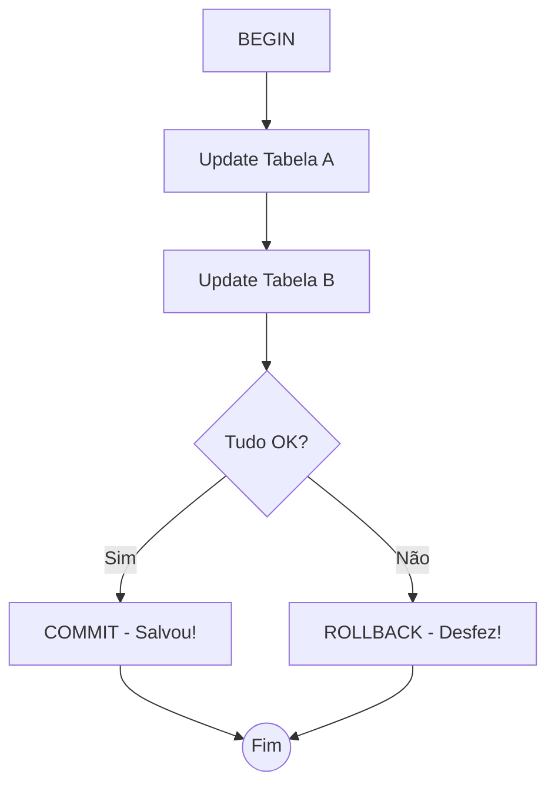

# Aula 09 - Transações e Integridade ACID 🔑

!!! tip "Objetivo"
    **Objetivo**: Compreender o conceito de transações no banco de dados, aprender a usar COMMIT e ROLLBACK para garantir a segurança dos dados e entender as propriedades ACID que tornam os SGBDs confiáveis.

---

## 1. O que é uma Transação? 🛡️

Uma transação é uma unidade lógica de trabalho que contém um ou mais comandos SQL. O banco de dados garante que ou **tudo** seja executado com sucesso ou **nada** seja executado.

Imagine uma transferência bancária:
1.  Tirar R$ 100 da conta A.
2.  Colocar R$ 100 na conta B.

Se o sistema travar no passo 1, o dinheiro some? **Não**, se usarmos transações!

---

## 2. Comandos de Transação 🕹️

*   `BEGIN`: Inicia a transação.
*   `COMMIT`: Salva as alterações permanentemente.
*   `ROLLBACK`: Cancela tudo o que foi feito desde o `BEGIN`.
*   `SAVEPOINT`: Cria um "checkpoint" para voltar apenas a um ponto específico.

---

## 3. As Propriedades ACID 💎

Para que um SGBD seja considerado confiável (como o PostgreSQL), ele deve seguir o ACID:

*   **A - Atomicidade**: A transação é atômica (tudo ou nada).
*   **C - Consistência**: O banco sempre passa de um estado válido para outro estado válido.
*   **I - Isolamento**: Transações simultâneas não interferem umas nas quais.
*   **D - Durabilidade**: Uma vez confirmada (COMMIT), a alteração não se perde mesmo em queda de energia.

---

## 4. Prática: Simulação de Transferência 💻

Vamos simular o cenário no terminal:

```termynal
$ BEGIN;
$ UPDATE contas SET saldo = saldo - 100 WHERE id = 1;
$ UPDATE contas SET saldo = saldo + 100 WHERE id = 2;
$ 
$ -- Ops! Vi que o ID 2 está errado.
$ ROLLBACK; -- Nada foi alterado no banco real!
```

---

## 5. Visualização de Fluxo (Mermaid) 📊



---

## 6. Níveis de Isolamento 🛡️

O banco pode lidar com leituras simultâneas de várias formas. Os problemas comuns que as transações evitam são:
*   **Leitura Suja**: Ler dados que foram alterados mas não confirmados por outra pessoa.
*   **Leitura Fantasma**: Surgimento de novas linhas no meio de uma transação.

---

## 7. Mini-Projeto: Sistema de Estorno 🚀

Crie uma sequência de comandos que simule uma compra em um e-commerce:
1.  `BEGIN`.
2.  Diminuir o estoque do produto.
3.  Registrar o pedido.
4.  Inserir um registro de log.
5.  Use um `ROLLBACK` simulando um erro no processamento do cartão de crédito.

---

## 8. Exercícios de Fixação 🧠

1.  O que acontece se um servidor de banco de dados cair no meio de uma transação que ainda não recebeu o `COMMIT`?
2.  Explique a propriedade **Durabilidade**.
3.  Qual a utilidade do comando `SAVEPOINT`?

---

**Próxima Aula**: Vamos consolidar o Módulo II com o [Projeto Parcial - Sistema Relacional Completo](../aulas/aula-10.md)! 🔐