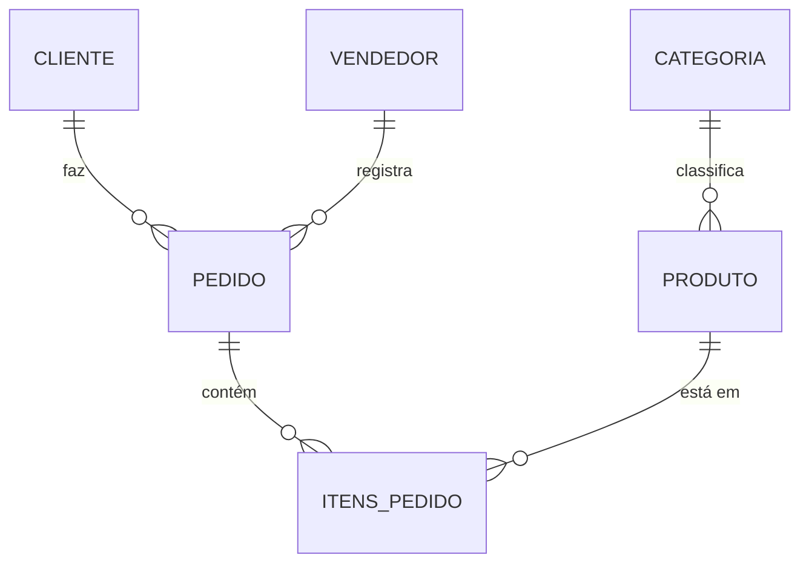

# Aula 10 - Projeto Parcial: Sistema Relacional 🔐

!!! tip "Objetivo"
    **Objetivo**: Consolidar todo o conhecimento do Módulo II através da criação de um sistema de banco de dados relacional completo, aplicando DDL, DML, DQL avançado e controle de transações.

---

## 1. O Desafio: E-commerce "TechStore" 🛒

Nesta aula, você não apenas aprenderá novos conceitos, mas aplicará tudo o que vimos até aqui em um cenário profissional real. O objetivo é construir a base de dados de uma loja de tecnologia.

### Requisitos do Sistema:
1.  **Clientes**: Cadastro completo.
2.  **Produtos**: Controle de estoque e categorias.
3.  **Vendas**: Registro de quem comprou, o que comprou e quando.
4.  **Segurança**: Garantia de que nenhuma venda seja registrada sem baixar o estoque (Transações).

---

## 2. Mapa Mental da Estrutura (Mermaid) 📊



---

## 3. Passo a Passo do Projeto 🛠️

### Fase 1: Fundação (DDL)
Criação das tabelas com todas as restrições (`PRIMARY KEY`, `FOREIGN KEY`, `NOT NULL`, `CHECK`).

### Fase 2: Povoamento (DML)
Inserção de dados realistas para testes. Pelo menos 5 clientes, 10 produtos e algumas vendas.

### Fase 3: Inteligência (DQL)
Criação de relatórios complexos:
*   Ranking de vendas por categoria.
*   Ticket médio por cliente.
*   Produtos mais vendidos.

---

## 4. Checklist de Qualidade 🛡️

*   [ ] O banco está na 3ª Forma Normal?
*   [ ] As chaves estrangeiras impedem a exclusão de clientes com pedidos?
*   [ ] Os preços são sempre maiores que zero?
*   [ ] As consultas usam JOINs e Aliases de forma clara?

---

## 5. Exemplo de Script Integrado 💻

```sql
BEGIN;

-- 1. Criar pedido
INSERT INTO pedidos (cliente_id, data) VALUES (1, CURRENT_DATE) RETURNING id;

-- 2. Adicionar item (Supondo ID do pedido = 50)
INSERT INTO itens_pedido (pedido_id, produto_id, qtd) VALUES (50, 10, 2);

-- 3. Baixar estoque
UPDATE produtos SET estoque = estoque - 2 WHERE id = 10;

COMMIT;
```

---

## 6. Prática: O "Gran Finale" no pgAdmin 🚀

Execute o script completo (que você desenvolverá no Projeto 10) e verifique se o banco se comporta corretamente em casos de erros (ROLLBACK) e sucessos (COMMIT).

---

## 7. Exercícios de Fixação 🧠

1.  Por que é melhor usar uma tabela associativa em `itens_pedido` em vez de colocar os produtos direto na tabela `pedidos`?
2.  Como você geraria um relatório mostrando os clientes que gastaram mais de R$ 1.000,00 no total?
3.  Quais índices você criaria para esse sistema para melhorar a performance de busca?

---

**Módulo III**: Prepare-se para o mundo moderno com a [Introdução ao NoSQL e MongoDB](../aulas/aula-11.md)! 🌐