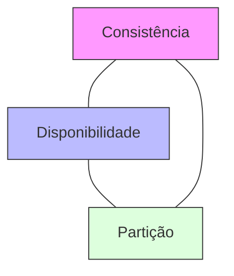

# Aula 11 - Introdução ao NoSQL e MongoDB 🌐

!!! tip "Objetivo"
    **Objetivo**: Entender o que são bancos de dados não relacionais (NoSQL), os motivos para sua existência e as principais diferenças conceituais em relação ao modelo SQL tradicional.

---

## 1. O que é NoSQL? 🧩

**NoSQL** (do inglês *Not Only SQL*) é um termo que engloba tecnologias de banco de dados que não utilizam o modelo de tabelas relacionais clássico de linhas e colunas.

### Por que surgiu?
*   **Escalabilidade**: Lidar com volumes massivos de dados distribuídos em vários servidores.
*   **Flexibilidade**: Armazenar dados com estruturas que mudam frequentemente (esquema flexível).
*   **Velocidade**: Alta performance em operações simples de leitura e escrita.

---

## 2. Tipos de Bancos NoSQL 📚

Existem quatro categorias principais:

1.  **Documento**: Guarda dados no formato JSON/BSON (Ex: **MongoDB**, CouchDB).
2.  **Chave-Valor**: Como um dicionário gigante (Ex: **Redis**, DynamoDB).
3.  **Coluna**: Otimizado para consultas analíticas pesadas (Ex: Cassandra, HBase).
4.  **Grafo**: Focado em conexões e redes (Ex: Neo4j).

---

## 3. SQL vs NoSQL: A Grande Batalha ⚔️

| Característica | SQL (PostgreSQL) | NoSQL (MongoDB) |
| :--- | :--- | :--- |
| **Estrutura** | Rígida (Tabelas) | Flexível (Documentos) |
| **Relacionamentos** | JOINs poderosos | Documentos aninhados |
| **Escalabilidade** | Vertical (Melhor Hardware) | Horizontal (Mais Servidores) |
| **Transações** | ACID nativo e forte | BASE (Eventual) |

---

## 4. O Modelo de Documento (JSON) 🏗️

No MongoDB, não temos tabelas, temos **Collections**. Não temos linhas, temos **Documents**.

```json
{
  "_id": "645a2b3c...",
  "nome": "Ricardo Pires",
  "idade": 35,
  "habilidades": ["SQL", "MongoDB", "Kotlin"],
  "endereco": {
    "rua": "Av. Brasil",
    "cidade": "São Paulo"
  }
}
```

---

## 5. Teorema CAP 📊

Em sistemas distribuídos, você só pode escolher **dois** destes três:
*   **C**onsistência (Consistency)
*   **A**vailabilidade (Availability)
*   **P**artição (Partition Tolerance)



---

## 6. Prática: Pensando sem Tabelas 💻

Imagine que você quer guardar as postagens de um blog.
*   **No SQL**: Tabela Posts, Tabela Comentários, Tabela Autores (3 tabelas + 2 JOINs).
*   **No NoSQL**: Um único documento "Post" contendo todos os comentários dentro dele.

```termynal
$ NoSQL = Menos JOINs, Mais Velocidade de Leitura.
$ SQL = Menos Redundância, Mais Integridade.
```

---

## 7. Exercícios de Fixação 🧠

1.  O que significa a sigla NoSQL?
2.  Dê um exemplo de cenário onde o MongoDB seria melhor que o PostgreSQL.
3.  Explique o conceito de **Escalabilidade Horizontal**.

---

**Próxima Aula**: Vamos colocar a mão na massa instalando o [MongoDB e fazendo o primeiro CRUD](./aula-12.md)! 🍃