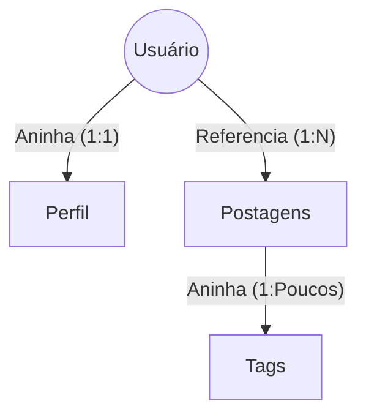

# Aula 13 - Modelagem de Documentos no NoSQL 🏗️

!!! tip "Objetivo"
    **Objetivo**: Aprender as duas principais estratégias de modelagem de dados no MongoDB (Aninhamento e Referência), entendendo as vantagens de cada uma e como decidir qual usar em projetos reais.

---

## 1. O Fim do JOIN? 🚫🔗

No SQL, a regra é: "Separe tudo em tabelas e use JOIN".
No NoSQL (MongoDB), a regra de ouro é: **"Dados que são acessados juntos, devem ser armazenados juntos"**.

---

## 2. Estratégia 1: Aninhamento (Embedding) 📦

Colocamos os dados relacionados dentro do próprio documento principal.

```json
{
  "nome": "Ciclano",
  "email": "ciclano@email.com",
  "enderecos": [
    { "rua": "Rua A", "cidade": "SP" },
    { "rua": "Rua B", "cidade": "RJ" }
  ]
}
```

*   **Vantagem**: Leitura ultrarrápida (uma única busca traz tudo).
*   **Quando usar**: Relacionamentos 1:1 ou 1:Poucos (ex: endereços de um usuário).

---

## 3. Estratégia 2: Referência (Linking) 🔗

Guardamos apenas o `_id` do documento relacionado, similar a uma chave estrangeira.

```json
// Documento de Pedido
{
  "data": "2024-01-01",
  "cliente_id": ObjectId("645a...")
}
```

*   **Vantagem**: Evita redundância e o crescimento excessivo de um único documento.
*   **Quando usar**: Relacionamentos 1:Muitos (ex: um blog com 10.000 comentários) ou N:N.

---

## 4. Como decidir? 🤔

Responda estas perguntas:
1.  **O dado cresce sem parar?** Se sim, use **Referência**.
2.  **Eu sempre preciso do dado filho para mostrar o pai?** Se sim, use **Aninhamento**.
3.  **Vários pais compartilham o mesmo filho?** Se sim, use **Referência**.

---

## 5. Visualização de Relações (Mermaid) 📊



---

## 6. Prática: Estruturando o Blog 💻

Tente modelar um post de blog com comentários:

```javascript
// Opção A: Embebed (comentários dentro do post)
db.posts.insertOne({
  titulo: "Aula 13",
  comentarios: [
    { autor: "Ana", texto: "Gostei!" },
    { autor: "Bob", texto: "Top!" }
  ]
});
```

---

## 7. Mini-Projeto: Dashboard de E-commerce 🚀

Modele o documento de um `Pedido`. Ele deve conter:
1.  Dados básicos do pedido.
2.  Dados do Cliente (Aninhado ou Referenciado?).
3.  Lista de Produtos (Cada produto deve ter o nome e o preço no momento da compra).

---

## 8. Exercícios de Fixação 🧠

1.  Qual o limite de tamanho de um documento no MongoDB? (Dica: pesquise por 16MB).
2.  O que acontece se eu aninhar dados demais em um único documento?
3.  Podemos misturar as duas estratégias (Híbrido) no mesmo banco?

---

**Próxima Aula**: Vamos aprender a extrair inteligência dos dados com [Consultas e Agregações no MongoDB](../aulas/aula-14.md)! 🧪