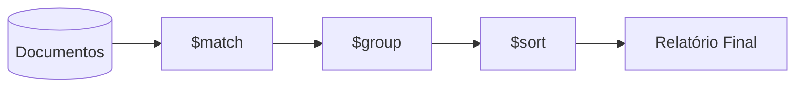

# Aula 14 - Consultas e Agregações no MongoDB 🧪

!!! tip "Objetivo"
    **Objetivo**: Dominar o Aggregation Framework do MongoDB para processar dados em larga escala, realizar agrupamentos complexos e simular junções com o $lookup.

---

## 1. O que é o Aggregation Framework? ⚙️

Diferente do simples `find()`, a agregação funciona como uma **linha de montagem** (Pipeline). Os dados entram, passam por várias etapas e saem transformados no final.

Cada etapa começa com o símbolo `$`.

---

## 2. As Etapas do Pipeline 🏗️

As mais comuns são:
*   **$match**: Filtra os documentos (equivalente ao WHERE).
*   **$group**: Agrupa os documentos (equivalente ao GROUP BY).
*   **$sort**: Ordena os resultados.
*   **$project**: Escolhe quais campos mostrar (Projeção).
*   **$limit**: Restringe o número de resultados.

---

## 3. Exemplo: Média de Preços 💰

```javascript
db.produtos.aggregate([
  { $match: { categoria: "Eletrônicos" } },
  { $group: { _id: "$categoria", mediaPreco: { $avg: "$preco" } } }
]);
```

---

## 4. O $lookup (O "Join" do NoSQL) 🔗

Se você seguiu a estratégia de **Referência**, precisará do `$lookup` para unir os dados na consulta.

```javascript
db.pedidos.aggregate([
  {
    $lookup: {
      from: "clientes",       // Tabela para unir
      localField: "cliente_id", // Campo no pedido
      foreignField: "_id",     // Campo no cliente
      as: "dados_cliente"      // Nome do novo campo
    }
  }
]);
```

---

## 5. Visualização do Pipeline (Mermaid) 📊



---

## 6. Performance e Índices ⚡

Fazer agregação em milhões de documentos pode ser lento.
*   **Índices**: Use `createIndex({ campo: 1 })` para acelerar as buscas.
*   O `$match` deve ser sempre a PRIMEIRA etapa do pipeline para diminuir o volume de dados logo no início.

---

## 7. Prática: Relatórios de Vendas 💻

Tente executar no mongosh:

```termynal
$ db.vendas.aggregate([
$   { $group: { _id: "$vendedor", total: { $sum: "$valor" } } },
$   { $sort: { total: -1 } }
$ ]);
```

---

## 8. Exercícios de Fixação 🧠

1.  Qual a diferença entre usar `find().sort()` e o pipeline `$sort` dentro do aggregate?
2.  Para que serve a etapa `$unwind`? (Dica: pesquise sobre Arrays no MongoDB).
3.  Posso usar o `$match` mais de uma vez no mesmo pipeline?

---

**Próxima Aula**: Vamos fechar o módulo com o [MongoDB no Ecossistema Moderno e Deploy](../aulas/aula-15.md)! 🚀