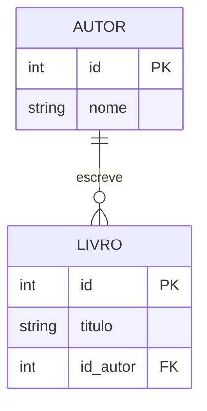

# Aula 02: Modelagem de Dados e Modelo E-R 🏗️
## Desenhando o Futuro
### Ricardo Pires
#### Bancos de Dados SQL e NoSQL

---

## 🎯 O que vamos aprender hoje?
- Abstração da Realidade
- Entidades, Atributos e Relacionamentos
- Chaves Primárias e Estrangeiras
- Cardinalidade e Integridade
- Noções de Diagramação (DER)

---

## 🧠 Por que modelar?
- Evitar retrabalho
- Garantir a lógica do negócio
- Planejar antes de executar
- "Planta baixa" do sistema 🏠 { .fragment }

---

## 🧱 Os Pilares do Modelo E-R
- **Entidade**: O "Substantivo" (O que?) 📦
- **Atributo**: O "Adjetivo" (Como?) 🏷️
- **Relacionamento**: O "Verbo" (Ação) 🔗

---

## 🎭 Entidade
- Objetos identificáveis
- Exemplos: `Cliente`, `Produto`, `Venda`, `Pessoa`
- Representadas por retângulos no diagrama { .fragment }

---

## 🏷️ Atributo
- Propriedades da entidade
- Exemplos para `Cliente`: `Nome`, `CPF`, `Email`, `Telefone`
- Definem o que será guardado

---

## 🔗 Relacionamento
- Conexão entre entidades
- Exemplo: Cliente **Compra** Produto
- Exemplo: Aluno **Assiste** Aula { .fragment }

---

## 🔑 A Chave Primária (PK)
- Identificador Único
- Não pode repetir
- Não pode ser nula (NULL)
- Exemplo: `id_usuario`, `CPF`, `ISBN` { .fragment }

---

## 🖇️ A Chave Estrangeira (FK)
- O Elo de Ligação
- Aponta para uma PK em outra tabela
- Permite "navegar" entre os dados
- Exemplo: `id_cliente` dentro da tabela `Pedidos` { .fragment }

---

## 📏 Cardinalidade
Quantos de um lado se ligam a quantos do outro?
1. **1:1**: Um para Um
2. **1:N**: Um para Muitos
3. **N:N**: Muitos para Muitos (M:N)

---

## 🥇 Relacionamento 1:1
- Exemplo: Um `País` tem uma `Capital`.
- Exemplo: Um `Cidadão` tem um `CPF`.
- Raro em modelagens simples, mas existe! 🎯 { .fragment }

---

## 🥈 Relacionamento 1:N
- O mais comum!
- Exemplo: Uma `Mãe` tem vários `Filhos`.
- Exemplo: Um `Autor` escreve vários `Livros`. 📚 { .fragment }

---

## 🥉 Relacionamento N:N
- Exemplo: Vários `Autores` escrevem vários `Livros`.
- Exemplo: Vários `Alunos` cursam várias `Matérias`. 🎓 { .fragment }
- **Atenção**: Precisa de uma tabela no meio!

---

## 🛡️ Integridade Referencial
- Regra de ouro: Nenhuma FK pode apontar para o nada!
- Mantém o banco consistente
- Evita erros de apagar dados relacionados

---

## 📊 O Diagrama E-R (DER)
- Visualização gráfica da estrutura
- Facilita a comunicação entre programadores
- Ferramentas: dbdiagram.io, brModelo, Draw.io

---

## 📉 Exemplo de Diagrama

---

## 💻 Ferramentas CASE
- **C**omputer-**A**ided **S**oftware **E**ngineering
- Softwares que ajudam no desenho
- Recomendação: [dbdiagram.io](https://dbdiagram.io) 🌐

---

## 🧩 Exercício Rápido
- Desenhe as tabelas para uma **Escola**:
- `Alunos`, `Turmas`, `Professores`.
- Como elas se ligam? { .fragment }

---

## 🚀 Dica de Especialista
- Modelagem bem feita = Consultas SQL fáceis
- Modelagem ruim = Dor de cabeça eterna! 🤯 { .fragment }

---

## 🏁 Resumo
- Vimos como transformar o mundo real em tabelas
- Aprendemos o papel das chaves (PK e FK)
- Entendemos as cardinalidades (1:1, 1:N, N:N)
- Vimos a importância do Diagrama E-R

---

## 👋 Até a próxima aula!
### Tema: Normalização e Estrutura 📡
["Ir para Exercícios"](../exercicios/exercicio-02.md)
