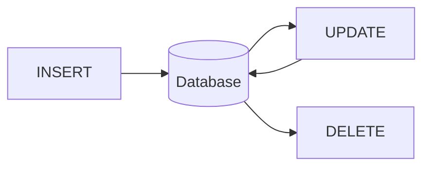

# Aula 05: DML - Manipulação de Dados ⚙️
## Gerenciando Informações
### Ricardo Pires
#### Bancos de Dados SQL e NoSQL

---

## 🎯 O que vamos aprender hoje?
- A linguagem DML
- Inserindo registros (INSERT)
- Atualizando dados (UPDATE)
- Excluindo registros (DELETE)
- Riscos e Boas Práticas
- Inserção em Massa

---

## 🏗️ Relembrando: DDL vs DML
- **DDL**: Cria o "balde" (Tabela) 🪣
- **DML**: Coloca a "água" (Dados) 💧
- Um define a estrutura, o outro o conteúdo! { .fragment }

---

## 📥 Comando INSERT
Para adicionar novos registros ao banco:
```sql
INSERT INTO alunos (nome, email)
VALUES ('Ricardo', 'ricardo@email.com');
```
- Ordem das colunas importa! { .fragment }

---

## 🔢 O Papel do SERIAL
- Você não precisa inserir o ID manualmente
- O PostgreSQL cuida da sequência
- Menos chance de erro de duplicidade! 🆔 { .fragment }

---

## 📦 Inserção Múltipla
Economize tempo e comandos:
```sql
INSERT INTO produtos (nome, preco)
VALUES 
    ('Mouse', 50.00),
    ('Teclado', 150.00),
    ('Monitor', 800.00);
```

---

## ✏️ Comando UPDATE
Para mudar dados que já existem:
```sql
UPDATE alunos
SET email = 'novo@email.com'
WHERE id = 1;
```
- `SET`: O que mudar
- `WHERE`: Quem mudar 🎯 { .fragment }

---

## ⚠️ Perigo: UPDATE sem WHERE
```sql
UPDATE funcionarios SET salario = 99999;
```
- Resultado: Todos os funcionários agora são ricos! 💸
- Na vida real: Você pode ser demitido! 😅 { .fragment }

---

## 🗑️ Comando DELETE
Para remover registros:
```sql
DELETE FROM alunos
WHERE id = 10;
```
- Remove a linha inteira, não apenas uma célula!

---

## 🛑 Perigo: DELETE sem WHERE
```sql
DELETE FROM pedidos;
```
- Apaga **TODA** a sua tabela de pedidos.
- Não há botão "Desfazer" (fora de transações). 🔥 { .fragment }

---

## 🧹 TRUNCATE vs DELETE
- `DELETE`: Apaga linha por linha (mais lento, gera logs).
- `TRUNCATE`: Esvazia a tabela de uma vez (instantâneo). ⚡
- Use `TRUNCATE` para limpar tabelas de log ou teste.

---

## 📊 Ciclo de Vida do Dado


---

## 💻 Prática no pgAdmin
1. Abrir Query Tool
2. Digitar o comando
3. Clicar no raio ⚡ ou apertar F5
4. Verificar a mensagem de sucesso!

---

## 🛡️ Dicas de Segurança
- Sempre faça um `SELECT` com o seu `WHERE` antes de rodar o `DELETE`.
- Se o `SELECT` trouxer os dados certos, o `DELETE` também trará. 🛡️ { .fragment }

---

## 🚀 Desafios do DML
- Manter a integridade (FKs)
- Lidar com valores `NULL`
- Performance em milhões de inserts

---

## 🧩 Mini-Desafio
- Como você aumentaria o preço de todos os livros em 15%?
- `SET preco = preco * 1.15` { .fragment }

---

## 🏁 Resumo
- Inserir com `INSERT`
- Mudar com `UPDATE` (Precisa de WHERE!)
- Apagar com `DELETE` (Precisa de WHERE!)
- Limpar com `TRUNCATE`

---

## 👋 Até a próxima aula!
### Tema: DQL Básico - Consultando Dados 💾
["Ir para Exercícios"](../exercicios/exercicio-05.md)