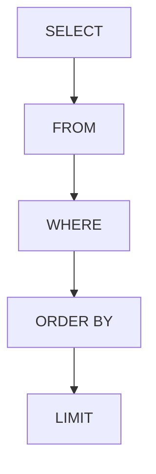

# Aula 06: DQL Básico 💾
## Consultando Dados
### Ricardo Pires
#### Bancos de Dados SQL e NoSQL

---

## 🎯 O que vamos aprender hoje?
- A linguagem DQL
- Comando SELECT
- Filtros com WHERE
- Operadores Lógicos e Matemáticos
- Ordenação (ORDER BY)
- Boas Práticas de Performance

---

## 🔍 O que é DQL?
- **D**ata **Q**uery **L**anguage
- Foco em **RECUPERAR** dados
- O comando mais usado: `SELECT` 🔎 { .fragment }

---

## 📽️ Projeção: O que ver?
```sql
SELECT nome, cpf FROM clientes;
```
- Escolhemos quais colunas a TV (resultado) vai mostrar.

---

## 🎬 Seleção: Quem ver?
```sql
SELECT * FROM clientes WHERE id = 5;
```
- O `WHERE` é o nosso controle remoto.
- Ele filtra as linhas que desejamos. 🎯 { .fragment }

---

## 🎯 Operadores de Filtro
- `=`: Igual
- `<>` ou `!=`: Diferente
- `>` e `<`: Maior/Menor
- `BETWEEN`: Entre valores 📏
- `IN`: Em uma lista 🧺 { .fragment }

---

## 📝 Busca por Padrão (LIKE)
- `%`: Qualquer coisa!
- `LIKE 'Ri%'`: Começa com Ri (Ricardo, Rio...) 🇧🇷
- `LIKE '%gmail.com'`: Termina com gmail.
- `ILIKE`: Busca sem diferenciar Maiúsculas/Minúsculas (PostgreSQL). { .fragment }

---

## 📶 Ordenando o Caos
```sql
SELECT * FROM produtos 
ORDER BY nome ASC; -- A-Z
```
- Use `DESC` para o contrário (Z-A ou Maior->Menor).
- Pode ordenar por mais de uma coluna! { .fragment }

---

## 💎 Valores Únicos (DISTINCT)
```sql
SELECT DISTINCT cidade FROM clientes;
```
- Se 10 clientes moram em SP, aparecerá "SP" apenas uma vez no resultado.

---

## 📊 Arquitetura do SELECT


---

## 🛑 O perigo do SELECT *
- Traz dados que você não vai usar
- Deixa a rede lenta
- Pior inimigo da performance em larga escala! 🐢
- **Dica**: Liste as colunas! { .fragment }

---

## 💻 Prática no pgAdmin
1. Escrever o SQL
2. F5 para rodar
3. Olhar a aba "Data Output"
4. Verificar o tempo de execução (milisegundos)

---

## 🧪 Combinando tudo
```sql
SELECT nome, preco 
FROM produtos 
WHERE categoria = 'Livros' 
  AND preco BETWEEN 20 AND 50
ORDER BY preco DESC;
```

---

## 🔢 Limitando Resultados (LIMIT)
- Quer apenas os 10 primeiros?
```sql
SELECT * FROM vendas LIMIT 10;
```
- Essencial para criar páginas no site (Paginação). 📄 { .fragment }

---

## 🏁 Resumo
- `SELECT` é para ler
- `WHERE` é para filtrar
- `ORDER BY` é para organizar
- `DISTINCT` limpa repetidos
- `LIMIT` controla o volume

---

## 👋 Até a próxima aula!
### Tema: Consultas Avançadas e Agregações 🧪
["Ver Exercícios"](../exercicios/exercicio-06.md)