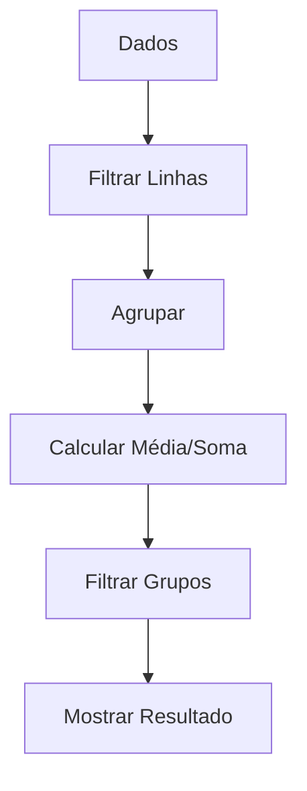

# Aula 07: Consultas Avançadas e Agregações 🧪
## O Poder dos Relatórios
### Ricardo Pires
#### Bancos de Dados SQL e NoSQL

---

## 🎯 O que vamos aprender hoje?
- Funções de Agregação (Stats)
- Apelidos com AS
- Agrupamento (GROUP BY)
- Filtro de Grupos (HAVING)
- Consultas Dinâmicas

---

## 🧮 Funções de Agregação
Servem para resumir grandes volumes de dados:
- `COUNT()`: Contar 🔢
- `SUM()`: Somar 💰
- `AVG()`: Média 📈
- `MIN()` e `MAX()`: Extremos 📉 { .fragment }

---

## 🔢 Contando com COUNT
```sql
SELECT COUNT(*) FROM usuarios;
```
- Quantas linhas no total?
- Use `COUNT(DISTINCT cidade)` para valores únicos. { .fragment }

---

## 💰 Somando com SUM
```sql
SELECT SUM(estoque) AS total_itens FROM produtos;
```
- Muito usado para faturamento, estoque e pontos.
- O `AS` deixa o resultado bonitinho! { .fragment }

---

## 📈 Média com AVG
```sql
SELECT AVG(nota) AS media_geral FROM provas;
```
- Útil para KPIs e indicadores de performance.

---

## 🧱 O Poder do GROUP BY
Você quer saber a média **por disciplina**?
```sql
SELECT disciplina, AVG(nota) 
FROM provas 
GROUP BY disciplina;
```
- Divide a tabela em "baldes" antes de calcular. { .fragment }

---

## 🎯 Filtrando com HAVING
O `WHERE` não funciona com funções de agregação!
```sql
-- Errado: WHERE AVG(nota) > 7
SELECT disciplina, AVG(nota) 
FROM provas 
GROUP BY disciplina 
HAVING AVG(nota) > 7;
```
- `HAVING` é o WHERE dos grupos! 🎯 { .fragment }

---

## 🏷️ Apelidos (ALIAS)
Não deixe suas colunas com nomes como `avg_1`.
```sql
SELECT SUM(valor) AS faturamento_anual FROM vendas;
```
- Profissionalismo e clareza nos relatórios. 🤝 { .fragment }

---

## 📊 Ordem de Execução do SQL
1. `FROM`: De onde vem?
2. `WHERE`: Quem sai?
3. `GROUP BY`: Como agrupa?
4. `HAVING`: Qual grupo sai?
5. `SELECT`: O que mostra?
6. `ORDER BY`: Qual a ordem? { .fragment }

---

## 📉 Visualizando o Fluxo


---

## 💻 Prática no pgAdmin
- Tente criar um ranking de vendas por categoria.
- Qual categoria é a campeã da sua loja? 🏆 { .fragment }

---

## 🚀 Dica de Performance
- Agregações em tabelas de milhões de linhas podem ser lentas.
- Considere criar tabelas de "Resumo" ou usar Índices. ⚡

---

## 🏁 Resumo
- Agregações resumem dados
- `GROUP BY` é o motor dos relatórios
- `HAVING` filtra o que já foi calculado
- `AS` organiza a exibição

---

## 👋 Até a próxima aula!
### Tema: JOINs - Unindo Tabelas 🔗
["Ir para Exercícios"](../exercicios/exercicio-07.md)