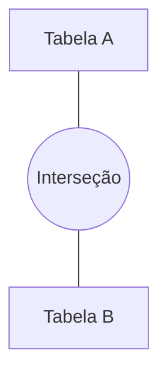

# Aula 08: JOINs - Junções 🔗
## Conectando os Pontos
### Ricardo Pires
#### Bancos de Dados SQL e NoSQL

---

## 🎯 O que vamos aprender hoje?
- Por que unir tabelas?
- INNER JOIN (O feijão com arroz)
- LEFT e RIGHT JOIN (Prioridades)
- FULL e CROSS JOIN
- A importância da cláusula ON
- Aliases para tabelas

---

## 🤝 Por que JOINs?
- Bancos de Dados são **Relacionais**
- Os dados estão em "caixas" diferentes
- Precisamos da "ponte" para ver a foto completa! 📸 { .fragment }

---

## 🎯 INNER JOIN
- O mais comum de todos.
- Retorna apenas onde há **combinação** nos dois lados.
```sql
SELECT pedidos.id, clientes.nome 
FROM pedidos 
INNER JOIN clientes ON pedidos.id_cliente = clientes.id;
```

---

## 📽️ Visualizando: INNER JOIN

- Se o cliente não tem pedido, ele não aparece.
- Se o pedido não tem cliente, ele não aparece. { .fragment }

---

## ⬅️ LEFT JOIN
- Quer ver **TUDO** da primeira tabela?
- Mesmo que não haja par na segunda?
- Use o LEFT JOIN!
```sql
SELECT clientes.nome, pedidos.id 
FROM clientes 
LEFT JOIN pedidos ON clientes.id = pedidos.id_cliente;
```

---

## ➡️ RIGHT JOIN
- Exatamente o oposto do Left.
- Prioriza quem está na **Direita** (a segunda tabela).
- Traz todos os pedidos, mesmo que o cliente tenha sido apagado. { .fragment }

---

## 🌐 FULL OUTER JOIN
- O "pacotão" completo.
- Traz tudo da esquerda e tudo da direita.
- Onde não houver par -> Preenche com `NULL`.

---

## ❌ CROSS JOIN
- Perigoso! 🛑
- Combina cada linha de A com cada linha de B.
- Tabela A (10 linhas) x Tabela B (10 linhas) = 100 linhas no resultado. { .fragment }

---

## 🏷️ Aliases de Tabela
Não sofra escrevendo nomes gigantes.
```sql
SELECT p.id, c.nome 
FROM pedidos AS p 
INNER JOIN clientes AS c ON p.id_cliente = c.id;
```
- Atalhos que salvam vidas (e dedos)! ⌨️ { .fragment }

---

## 🔗 Unindo 3 ou Mais Tabelas
- Basta ir "pendurando" mais JOINs.
```sql
SELECT c.nome, p.id, pr.nome_produto
FROM clientes c
JOIN pedidos p ON c.id = p.id_cliente
JOIN itens i ON p.id = i.id_pedido
JOIN produtos pr ON i.id_produto = pr.id;
```

---

## 💻 Prática no pgAdmin
- Vamos descobrir quais alunos estão sem turmas.
- Qual tipo de JOIN usaríamos?
- **LEFT JOIN** entre Alunos e Turmas! 🎓 { .fragment }

---

## 🚀 Dica Pro: Filtrando JOINs
- Você pode usar `WHERE` normalmente após os JOINs.
```sql
SELECT c.nome, p.valor 
FROM clientes c 
JOIN pedidos p ON c.id = p.id_cliente 
WHERE p.valor > 100;
```

---

## 🏁 Resumo
- JOIN une o que está separado
- `INNER`: Interseção
- `LEFT`: Prioridade Esquerda
- `RIGHT`: Prioridade Direita
- `ON`: Onde elas se ligam

---

## 👋 Até a próxima aula!
### Tema: Transações e Integridade ACID 🔑
["Ir para Exercícios"](../exercicios/exercicio-08.md)