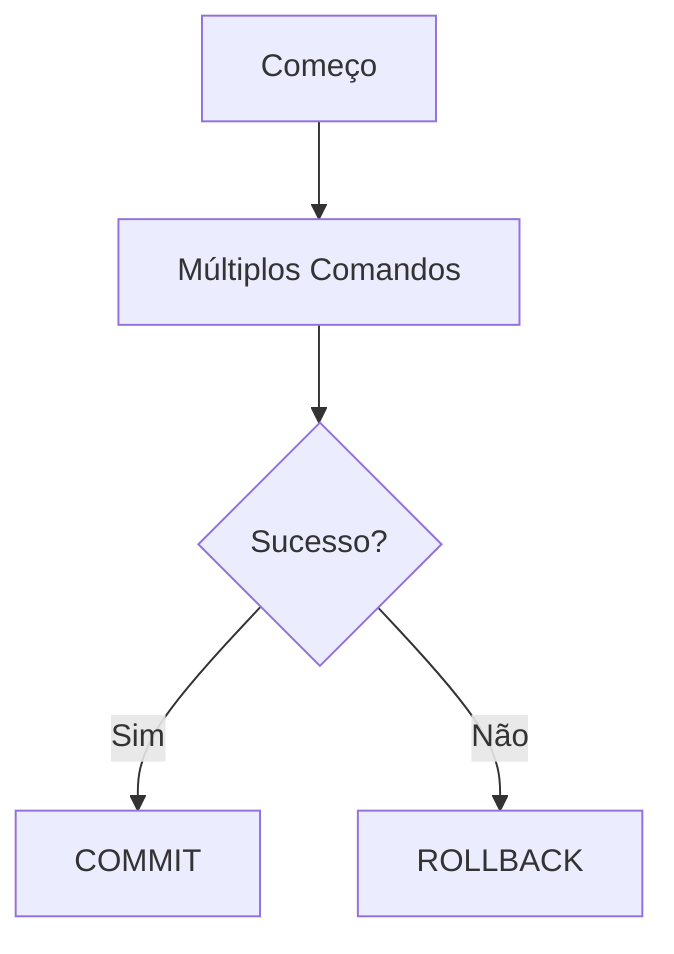

# Aula 09: Transações e ACID 🔑
## Segurança e Integridade
### Ricardo Pires
#### Bancos de Dados SQL e NoSQL

---

## 🎯 O que vamos aprender hoje?
- O que é uma Transação?
- O ciclo: BEGIN, COMMIT, ROLLBACK
- Propriedades ACID (O Coração do SGBD)
- Savepoints
- Exemplos do Mundo Real

---

## 🛡️ O que é uma Transação?
- Uma "viagem" de dados que deve chegar ao fim.
- Ou chegamos ao destino, ou voltamos para casa!
- Ex: Pagamento via PIX 💸 { .fragment }

---

## 🕹️ Comandos de Controle
- `BEGIN`: "Ligar o motor" 🗝️
- `COMMIT`: "Confirmar chegada" (Salvar) ✅
- `ROLLBACK`: "Voltar para o início" (Desfazer) 🔙 { .fragment }

---

## 🏧 Exemplo: Transferência
1. `BEGIN`;
2. Subtrai R$ 100 de Ciclano;
3. Adiciona R$ 100 a Beltrano;
4. Se der erro -> `ROLLBACK`;
5. Se ok -> `COMMIT`. { .fragment }

---

## 💎 Propriedades ACID
As 4 regras que definem um banco confiável:
1. **A**tomicidade
2. **C**onsistência
3. **I**solamento
4. **D**urabilidade

---

## ⚛️ A - Atomicidade
- A transação é um átomo: indivisível.
- Tudo acontece ou nada acontece.
- Sem meio-termo! { .fragment }

---

## ⚖️ C - Consistência
- O banco nunca aceita dados que quebrem as regras.
- Ex: Não deixa criar um pedido para um cliente que não existe.
- O banco é sempre um lugar organizado. 🏛️ { .fragment }

---

## 🔒 I - Isolamento
- Transações simultâneas não se "atropelam".
- O resultado de duas transações ao mesmo tempo é o mesmo de uma após a outra.

---

## 💾 D - Durabilidade
- Uma vez feito o `COMMIT`, os dados estão no disco.
- Pode acabar a luz, o servidor reiniciar... os dados estarão lá! 🔋 { .fragment }

---

## 📍 Savepoint: Pontos de Apoio
- Quer desfazer apenas uma parte?
```sql
BEGIN;
INSERT INTO logs ...
SAVEPOINT s1;
UPDATE saldo ... -- Deu erro!
ROLLBACK TO s1; -- Volta só até o log
COMMIT;
```

---

## 📊 Fluxo de Decisão


---

## 🛑 Transações Implícitas
- No PostgreSQL, cada comando `INSERT`/`UPDATE`/`DELETE` sozinho é uma transação automática.
- Para unir vários, você deve usar o `BEGIN` manual. 🤝 { .fragment }

---

## 💻 Prática no pgAdmin
- Vamos simular uma falha de sistema.
- Deletar dados e dar ROLLBACK.
- O alívio de ver os dados voltando! 😮💨 { .fragment }

---

## 🚀 Dica de Especialista
- Mantenha transações curtas.
- Transações abertas por muito tempo podem travar o banco para outros usuários (Lock). 🔐

---

## 🏁 Resumo
- Transações protegem seus dados
- ACID garante a confiabilidade
- COMMIT salva, ROLLBACK desfaz
- Atomicidade é o "Tudo ou Nada"

---

## 👋 Até a próxima aula!
### Tema: Projeto Parcial - Sistema Relacional 🔐
["Ir para Prática"](../exercicios/exercicio-09.md)