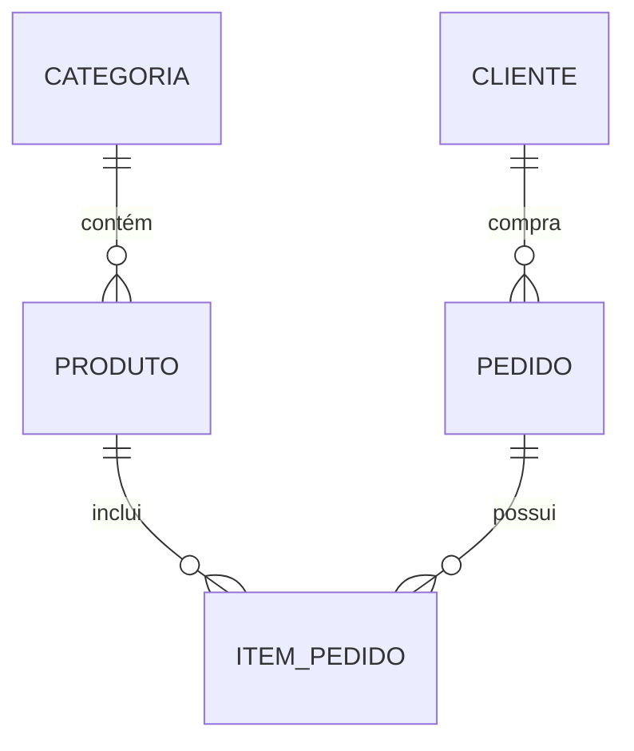

# Aula 10: Projeto Parcial Relacional 🔐
## Concluindo o Módulo II
### Ricardo Pires
#### Bancos de Dados SQL e NoSQL

---

## 🎯 O que vamos fazer hoje?
- Revisão Geral (DDL, DML, DQL)
- Integração de Conceitos
- O Grande Script do E-commerce
- Auditoria e Segurança
- Preparação para o Módulo III (NoSQL)

---

## 🏗️ Passo 1: Estrutura (DDL)
- Criar Tabelas
- Definir PKs e FKs
- Aplicar CHECKs e NOT NULLs
- Criar Índices de performance { .fragment }

---

## 📥 Passo 2: Dados (DML)
- Inserir Clientes
- Inserir Produtos
- Gerar Pedidos
- Simular Vendas { .fragment }

---

## 🔎 Passo 3: Consultas (DQL)
- Unir tabelas com JOINs
- Agrupar com GROUP BY
- Filtrar grupos com HAVING
- Ordenar relatórios { .fragment }

---

## 🔑 Passo 4: Segurança (ACID)
- Usar Transações (BEGIN/COMMIT)
- Testar Rollbacks em falhas simuladas
- Garantir a integridade entre Estoque e Pedido { .fragment }

---

## 📊 O Esquema Completo

---

## 💻 Mão na Massa!
- Objetivo: Um script `.sql` único que cria e popula todo o ecossistema.
- É o seu primeiro grande degrau como DBA! 🪜 { .fragment }

---

## 🧪 Relatórios de Auditoria
- Quais produtos estão sem estoque?
- Qual cliente gastou mais no mês?
- Existe algum pedido sem item? (Auditoria de erro) { .fragment }

---

## 🚀 Desafio de Otimização
- Adicione um Índice na data do pedido.
- Veja a diferença de tempo no `EXPLAIN ANALYZE`. ⚡

---

## 🏁 Resumo do Módulo II
- Aprendemos a criar estruturas sólidas.
- Dominamos a manipulação de dados.
- Criamos relatórios de nível profissional.
- Entendemos a segurança transacional.

---

## 👋 Parabéns!
### Você concluiu a jornada Relacional.
### Próxima parada: O mundo NoSQL com MongoDB! 🌐
["Acessar Projeto 10"](../projetos/projeto-10.md)