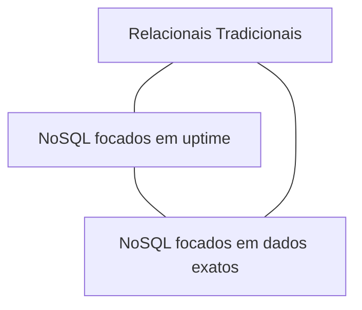

# Aula 11: Introdução ao NoSQL 🌐
## Além das Tabelas
### Ricardo Pires
#### Bancos de Dados SQL e NoSQL

---

## 🎯 O que vamos aprender hoje?
- A revolução NoSQL
- SQL vs NoSQL
- Tipos de bancos não-relacionais
- Vantagens e Casos de Uso
- O Modelo de Documento
- Teorema CAP

---

## 🧩 O que é NoSQL?
- "Not Only SQL"
- Flexibilidade total de dados
- Escalabilidade Massiva 🌍
- Fim da rigidez das tabelas { .fragment }

---

## 🏗️ Por que mudar?
- **Big Data**: Volume gigante de dados
- **Agilidade**: Mudanças rápidas no código
- **Nuvem**: Facilidade de distribuir servidores
- **Performance**: Leituras ultrarrápidas { .fragment }

---

## ⚔️ SQL vs NoSQL
- SQL = Tabela, Relacional, Rígido 🏛️
- NoSQL = Documento, Flexível, Elástico 🍃
- Um é melhor que o outro? **Depende do problema!** { .fragment }

---

## 📚 As 4 Famílias NoSQL
1. **Documento**: (MongoDB) - JSON/BSON
2. **Chave-Valor**: (Redis) - Dicionário
3. **Colunas**: (Cassandra) - Dados esparsos
4. **Grafos**: (Neo4j) - Redes e Conexões { .fragment }

---

## 🍃 Foco: MongoDB
- O banco NoSQL mais popular do mundo.
- Baseado em **Documentos**.
- Coleções em vez de Tabelas.
- Sem JOINs obrigatórios! 🚫🔗 { .fragment }

---

## 📦 O Documento (Exemplo)
```json
{
  "nome": "Cadu",
  "cargo": "Desenvolvedor",
  "tags": ["SQL", "NoSQL"],
  "ativo": true
}
```
- Se amanhã quiser adicionar "idade", basta inserir!

---

## 📉 Escalabilidade Horizontal
- SQL: Comprar um servidor mais caro (Vertical). 🏠 -> 🏰
- NoSQL: Comprar vários servidores baratos (Horizontal). 🏠 -> 🏠🏠🏠
- Muito mais barato para escalas gigantes. { .fragment }

---

## 📐 Teorema CAP
Em sistemas distribuídos, escolha apenas 2:
1. **C**onsistência: Dados iguais em todo lugar.
2. **A**vailabilidade: Sempre respondendo.
3. **P**artição: Funciona com queda de rede. { .fragment }

---

## 📊 Visualizando o Teorema


---

## 🤝 Relacionamento?
- No SQL: Usamos JOIN em tabelas separadas.
- No NoSQL: **Aninhamos** (Embed) os dados.
- O Pedido já contém o Cliente dentro dele! 📦 { .fragment }

---

## 💻 Prática: O pensamento JSON
- Como seria o JSON de um Carrinho de Compras?
- Lista de produtos dentro de um único objeto.
- Muito mais natural para o Programador. 👩‍💻 { .fragment }

---

## 🚀 Onde usar NoSQL?
- Redes Sociais
- Catálogos de E-commerce
- Jogos Online
- Logs e Telemetria (IOT)
- Cache de Alta Velocidade

---

## 🏁 Resumo
- NoSQL não é "Sem SQL", é "Além do SQL".
- MongoDB é focado em documentos flexíveis.
- Escalabilidade horizontal é a chave da nuvem.
- Teorema CAP define as regras do jogo.

---

## 👋 Até a próxima aula!
### Tema: Mão na massa com MongoDB e CRUD 🍃
["Ver Exercícios"](../exercicios/exercicio-11.md)