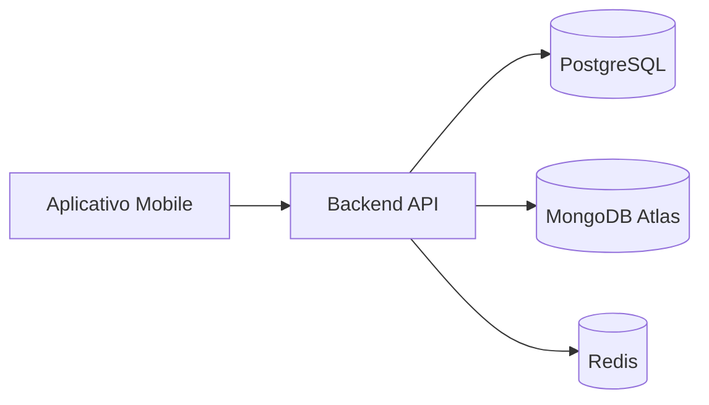

# Aula 15: NoSQL Profissional 🚀
## Ecossistema e Cloud
### Ricardo Pires
#### Bancos de Dados SQL e NoSQL

---

## 🎯 O que vamos aprender hoje?
- MongoDB Atlas (Cloud)
- Estratégias de Segurança
- Arquitetura Poliglota
- Quando usar (e não usar) NoSQL
- O Futuro: IA e Vector Search

---

## ☁️ MongoDB Atlas
- O banco como serviço (DBaaS).
- Gratuito para começar (Plano M0). 🎁
- Deploy em AWS, Google Cloud ou Azure.
- Escalonamento automático! { .fragment }

---

## 🔐 Segurança em Primeiro Lugar
- **Encryption**: Dados cifrados no disco.
- **Whitelist**: Apenas SEU servidor entra.
- **Principled Access**: Senhas fortes e acessos limitados. 🛡️ { .fragment }

---

## 🏗️ Persistência Poliglota
"Nem só de documentos vive o homem".
- SQL: Para o que é rígido e transacional. 🏦
- NoSQL: Para o que é flexível e massivo. 🌬️
- Redis: Para o que é instantâneo. ⚡ { .fragment }

---

## 📈 Escalabilidade Horizontal
- O grande trunfo do NoSQL.
- Dividir para conquistar: **Sharding**.
- Milhares de servidores trabalhando como um só. 🤝 { .fragment }

---

## 🤖 MongoDB + IA
- Busca Vetorial (Vector Search).
- Alimente suas LLMs com dados do MongoDB.
- Recomendação por similaridade.
- O futuro já chegou! 🌌 { .fragment }

---

## 📉 Visualizando a Arquitetura

---

## 💻 Prática: Setup na Nuvem
- Criar cluster no Atlas.
- Configurar usuário de banco.
- Liberar IP.
- Conectar no Compass. 🔗 { .fragment }

---

## 🚀 Quando dizer NÃO ao NoSQL
- Precisa de integridade relacional absoluta? (SQL)
- Esquema de dados fixo e simples? (SQL)
- Equipe só domina SQL e o projeto é pequeno? (SQL) { .fragment }

---

## 🏁 Resumo
- NoSQL é uma ferramenta, não uma religião.
- Cloud facilita a vida do Dev.
- Segurança não é opcional.
- O ecossistema moderno é híbrido.

---

## 👋 Até a Aula Final!
### Tema: O Grande Projeto Integrador 🎓
["Fazer Exercícios"](../exercicios/exercicio-15.md)