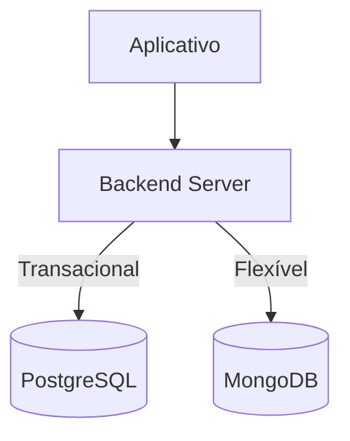

# Aula 16: O Grande Projeto Final 🎓
## Mestre dos Dados
### Ricardo Pires
#### Bancos de Dados SQL e NoSQL

---

## 🎯 O Grande Dia!
- Chegamos ao fim da jornada.
- Hoje você integra tudo o que aprendeu.
- De Tabelas SQL a Documentos NoSQL.
- O desafio de um Arquiteto de Dados real.

---

## 🦸‍♂️ O Projeto OmniStore
- Uma loja global.
- SQL: Para compras e estoque. 💰
- NoSQL: Para logs e catálogo flexível. 🍃
- O objetivo é a PERFORMANCE e a SEGURANÇA. { .fragment }

---

## 📋 Requisitos SQL
1. **Modelagem**: 3ª Forma Normal.
2. **Consultas**: Relatórios complexos (JOINs).
3. **Integridade**: Restrições e Chaves.
4. **Transações**: Segurança financeira. ✅ { .fragment }

---

## 🍃 Requisitos NoSQL
1. **Foco**: Dados desestruturados.
2. **Modelagem**: Aninhamento estratégico.
3. **Poder**: Pipeline de Agregação.
4. **Escala**: Atlas (Nuvem). ✅ { .fragment }

---

## 📊 A Arquitetura Integrada

---

## ✨ Dicas de Super-Dev
- **Qualidade**: Código limpo e comentado.
- **Visual**: Use o Mermaid para seus diagramas.
- **Narrativa**: Explique suas decisões no README.
- **Portfolio**: Poste esse projeto no seu GitHub! 🐙 { .fragment }

---

## 📚 E agora? Para onde ir?
- Engenharia de Dados (ETL) 🚀
- Ciência de Dados e IA (Python) 🤖
- Arquitetura de Nuvem (AWS/GCP) ☁️
- Big Data (Cluster Computing) 📈

---

## 🎓 Conclusão do Curso
- Você não é mais um "copiador de código".
- Você entende a lógica dos dados.
- O mercado te espera com grandes desafios (e salários). 🤝 { .fragment }

---

## 🌟 Mensagem Final
- Nunca pare de buscar dados.
- Nunca pare de questionar a estrutura.
- O dado é a alma da computação.

---

## 👋 Parabéns, Mestre!
### Foi uma honra caminhar com você.
#### Até o próximo curso! 🚀🚀🚀