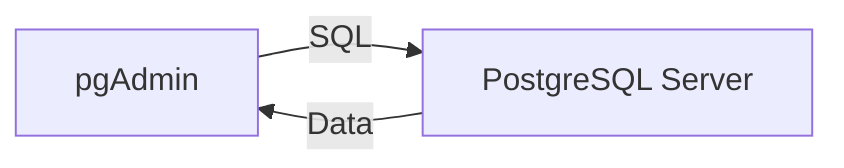

# Aula 01: Introdução a Bancos de Dados 🗄️
## Fundamentos e Evolução
### Ricardo Pires
#### Bancos de Dados SQL e NoSQL

---

## 🎯 O que vamos aprender hoje?
- Diferença entre Dados e Informação
- O que é um Banco de Dados
- Evolução Histórica
- Sistemas Gerenciadores (SGBD)
- Arquitetura Cliente/Servidor

---

## 🧩 Dado vs Informação
### O que é um Dado?
- Elemento bruto
- Sem contexto
- Exemplo: `42`, `Azul`, `19/02/2026` <!-- .element: class="fragment" -->

---

## 📈 O que é Informação?
- Dado processado
- Com contexto
- Exemplo: `A temperatura agora é 42°C` <!-- .element: class="fragment" -->
- Exemplo: `A cor favorita do João é Azul` <!-- .element: class="fragment" -->

---

## 🗄️ O que é um Banco de Dados?
- Uma coleção organizada de dados
- Permite acesso, gerenciamento e atualização
- Pense em uma biblioteca digital 📚 <!-- .element: class="fragment" -->

---

## 🕰️ A Evolução do Armazenamento
1. Arquivos Planos (TXT, CSV)
2. Modelo Hierárquico
3. Modelo Relacional (O Rei! 👑)
4. Modelo NoSQL (Flexibilidade 🚀)

---

## 🏛️ O Modelo Relacional
- Criado por Edgar F. Codd (1970)
- Baseado em **Tabelas** (Relações)
- Linhas (Registros) e Colunas (Atributos)

---

## 🛠️ O que é um SGBD?
- **S**istema **G**erenciador de **B**anco de **D**ados
- É o software que controla o acesso aos arquivos
- Exemplo: O bibliotecário que organiza as prateleiras 🤵 <!-- .element: class="fragment" -->

---

## 🐘 Exemplos de SGBDR
- **PostgreSQL** (Nosso foco!)
- **MySQL**
- **Oracle**
- **SQL Server**
- **SQLite**

---

## 🏗️ Arquitetura Cliente/Servidor
- O Servidor guarda os dados
- O Cliente (você) faz as perguntas (Queries)
- O PostgreSQL roda como um serviço no fundo

---

## 📊 Fluxo de Comunicação


---

## 💻 Primeiros Passos: psql
```bash
psql --version
```
```bash
psql -U postgres
```
<!-- .element: class="fragment" -->

---

## 🔑 A Importância da Senha
- Durante a instalação, você criou uma senha
- Ela protege o usuário `postgres`
- Anote em lugar seguro! 🛡️ <!-- .element: class="fragment" -->

---

## 📑 O Modelo Relacional em Detalhes
- Tudo é uma Tabela
- Colunas definem o **Esquema**
- Linhas são os **Dados Reais**

---

## 🧩 Exemplo de Tabela: Livros
| ID | Título | Autor | ISBN |
|---|---|---|---|
| 1 | Dom Casmurro | M. Assis | 123-X |
| 2 | O Hobbit | Tolkien | 456-Y |

---

## 🚀 Por que usar o PostgreSQL?
- Extremamente robusto
- Gratuito (Open Source)
- Suporta dados complexos (JSONB, GIS)
- Confiabilidade total (ACID)

---

## 🔍 SQL: A Língua dos Dados
- **S**tructured **Q**uery **L**anguage
- Padronizada mundialmente
- Comum a quase todos os bancos relacionais

---

## 🧠 Desafio da Aula
- Pense em um sistema de **Aluguel de Carros**
- Quais tabelas você criaria?
- Quais dados guardaria em cada uma?

---

## 🔗 Próximos Passos
1. Instalar o PostgreSQL (Setup 01)
2. Abrir o pgAdmin 4
3. Explorar a interface

---

## 🏁 Resumo
- Vimos que dados precisam de contexto
- Entendemos o papel do SGBD
- Visualizamos a arquitetura Cliente/Servidor
- Escolhemos o PostgreSQL como nossa ferramenta! 🐘

---

## 👋 Até a próxima aula!
### Tema: Modelagem de Dados e E-R 🏗️
["Voltar para o Início"](../index.md)
