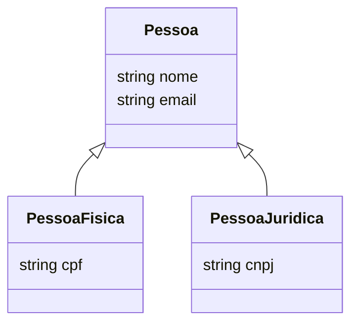

# Aula 03: Normalização e Estrutura 📡
## Organizando a Bagunça
### Ricardo Pires
#### Bancos de Dados SQL e NoSQL

---

## 🎯 O que vamos aprender hoje?
- Tipos de Dados no PostgreSQL
- O que é Normalização
- As 3 Formas Normais (1FN, 2FN, 3FN)
- Quando Desnormalizar?
- Especialização e Generalização

---

## 🧩 Tipos de Dados: A Base
- **Inteiros**: `INT`, `BIGINT`
- **Decimais**: `NUMERIC`, `REAL`
- **Texto**: `VARCHAR(N)`, `TEXT`
- **Tempo**: `DATE`, `TIMESTAMP`
- **Booleano**: `BOOLEAN` (True/False)

---

## 🤔 O que é NULL?
- Não é Zero! 0️⃣
- Não é Espaço Vazio! " "
- É **AUSÊNCIA** de valor
- É o "não sei" do banco de dados <!-- .element: class="fragment" -->

---

## ⚖️ O que é Normalização?
Processo de organizar tabelas para:
- Eliminar redundância (repetição)
- Evitar anomalias (erro ao apagar/mudar)
- Manter a integridade

---

## 📏 1ª Forma Normal (1FN)
### Regra da Atomicidade
- Cada campo deve ter um valor **único**
- Sem listas! `(Telefone1, Telefone2)` ❌
- Sem vários valores em um campo `Joao, Maria` ❌ <!-- .element: class="fragment" -->

---

## 🔨 Como resolver a 1FN?
- Transformar listas em novas linhas
- Ou criar uma nova tabela para o atributo multivalorado
- Ex: Tabela `Telefones_Cliente` <!-- .element: class="fragment" -->

---

## 📐 2ª Forma Normal (2FN)
- Deve estar na 1FN
- Colunas não-chave devem depender da **PK Inteira**
- Foco em Chaves Compostas <!-- .element: class="fragment" -->

---

## 📦 Exemplo 2FN
- Tabela `Item_Pedido` (ID_Pedido, ID_Produto, Nome_Produto)
- O `Nome_Produto` depende apenas do `ID_Produto`, não do pedido!
- **Solução**: Mover o nome para a tabela `Produtos`. <!-- .element: class="fragment" -->

---

## 📐 3ª Forma Normal (3FN)
- Deve estar na 2FN
- Eliminar dependências **Transitivas**
- Coluna não-chave não pode depender de outra coluna não-chave

---

## 🚛 Exemplo 3FN
- Tabela `Clientes` (ID, Nome, CEP, Cidade, Estado)
- `Cidade` e `Estado` dependem do `CEP`, não diretamente do `ID` do cliente.
- **Solução**: Tabela `Enderecos` ou `CEPs`. <!-- .element: class="fragment" -->

---

## 🔄 Desnormalização
- Quando as regras cansam o servidor 🥵
- Voltar atrás e aceitar redundância para ganhar **Velocidade**
- Comum em Big Data e Relatórios (Data Warehouse)

---

## 🧬 Generalização
- Criar uma entidade comum (Pai)
- Ex: `Veículo` (Placa, Ano, Cor)
- Atributos que todos os filhos possuem <!-- .element: class="fragment" -->

---

## 🔍 Especialização
- Criar entidades específicas (Filhas)
- Ex: `Caminhão` (Capacidade de Carga)
- Ex: `Moto` (Cilindradas)
- Herdam do Pai! 继承 <!-- .element: class="fragment" -->

---

## 📊 Visualizando no Mermaid

---

## 💻 Prática de Normalização
Imagine uma planilha com:
`ID, Nome_Aluno, Materia1, Materia2, Materia3`
- Como você aplicaria a 1FN aqui? <!-- .element: class="fragment" -->

---

## 🚀 Dica de Ouro
"Normalize até doer, desnormalize até funcionar."
- Encontre o equilíbrio entre estrutura e performance! ⚖️ <!-- .element: class="fragment" -->

---

## 🏁 Resumo
- Tipos de dados garantem consistência
- Normalização limpa a redundância
- 1FN = Sem listas
- 2FN = Dependência da PK total
- 3FN = Sem dependência entre vizinhos

---

## 👋 Até a próxima aula!
### Tema: DDL - Criando a Estrutura 🏗️
["Ver Exercícios"](../exercicios/exercicio-03.md)