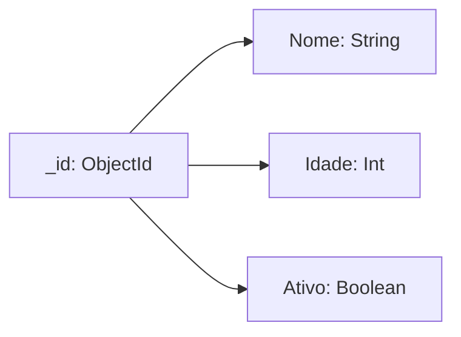

# Aula 12: Mão na Massa com MongoDB 🍃
## Instalando e Criando
### Ricardo Pires
#### Bancos de Dados SQL e NoSQL

---

## 🎯 O que vamos aprender hoje?
- Preparação: Atlas vs Local
- Ferramentas: mongosh e Compass
- Vocabulário NoSQL
- Operações de Escrita (Create)
- Operações de Busca (Read)
- Atualização e Exclusão (Update/Delete)

---

## 🛠️ Onde rodar o MongoDB?
1. **Local**: Na sua máquina (Performance máxima).
2. **Cloud (Atlas)**: Na nuvem (Praticidade/Equipe). 🏗️
- Dica: Comece pelo Compass para ver os dados! <!-- .element: class="fragment" -->

---

## 🗣️ Traduzindo o Dialeto
- Tabela? -> **Coleção** 📂
- Linha? -> **Documento** 📄
- Coluna? -> **Campo** (Field) 🏷️ <!-- .element: class="fragment" -->

---

## ✍️ Criando Dados (Create)
```javascript
db.alunos.insertOne({
  nome: "Lucas",
  curso: "ADS",
  periodo: 3
});
```
- O banco cria a coleção na hora se não existir! ✨

---

## 🔎 Buscando Dados (Read)
```javascript
db.alunos.find({ curso: "ADS" });
```
- Use `.pretty()` no terminal para ficar legível.
- Use `.count()` para saber quantos tem. <!-- .element: class="fragment" -->

---

## 🎯 Filtros Inteligentes
- `$gt`: Maior que (> )
- `$lt`: Menor que (< )
- `$in`: Está na lista 🧺
- `$or`: Uma coisa ou outra 🔀 <!-- .element: class="fragment" -->

---

## 🔄 Atualizando (Update)
```javascript
db.alunos.updateOne(
  { nome: "Lucas" },
  { $set: { ativo: true } }
);
```
- **Atenção**: Sem o `$set`, você substitui o documento inteiro! 🛑 <!-- .element: class="fragment" -->

---

## 🗑️ Deletando (Delete)
```javascript
db.alunos.deleteOne({ _id: 1 });
```
- Rápido e direto.
- `deleteMany({})` limpa tudo! (Use com cautela). 🧨 <!-- .element: class="fragment" -->

---

## 📊 Arquitetura do Documento


---

## 💻 Prática no Compass
1. Conectar na URL (localhost ou srv).
2. Criar Banco e Coleção.
3. Importar um JSON de teste.
4. Fazer buscas visuais.

---

## 🚀 Dica de Ouro: Bulk Insert
- Vai inserir 1.000 itens?
- Use `insertMany([...])`.
- Muito mais rápido que 1.000 `insertOne`. ⚡

---

## 🏁 Resumo
- CRUD é o motor da aplicação.
- MongoDB é simples: chave/valor no JSON.
- Operadores começam com `$`.
- O banco é flexível, mas exige responsabilidade.

---

## 👋 Até a próxima aula!
### Tema: Estratégias de Modelagem NoSQL 🏗️
["Praticar Exercícios"](../exercicios/exercicio-12.md)