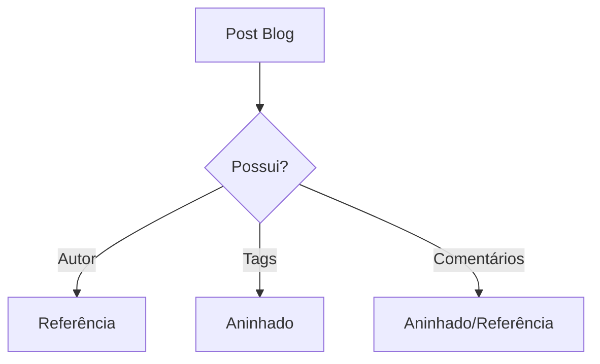

# Aula 13: Modelagem NoSQL 🏗️
## Aninhar ou Referenciar?
### Ricardo Pires
#### Bancos de Dados SQL e NoSQL

---

## 🎯 O que vamos aprender hoje?
- A estratégia NoSQL
- O fim do JOIN obrigatório
- Embedding (Aninhamento)
- Referencing (Referência)
- O Limite de 16MB
- Casos de Uso Práticos

---

## 🚫🔗 O Fim do JOIN?
- No SQL: Dados espalhados = Muitos JOINs 🚗---🚕
- No NoSQL: Dados juntos = Velocidade Máxima 🏎️
- **Dica**: Desenhe o banco pensando na tela do App! <!-- .element: class="fragment" -->

---

## 📦 Estratégia 1: Aninhamento
- Colocar o "filho" dentro do "pai".
- `USUARIO` contém `ENDEREÇOS`.
- **Vantagem**: Uma busca = Tudo na mão! ✅
- **Risco**: Dados duplicados. <!-- .element: class="fragment" -->

---

## 🔗 Estratégia 2: Referência
- Guardar apenas o link (`_id`).
- `CATEGORIA` referencia `PRODUTOS`.
- **Vantagem**: Sem redundância. ✅
- **Risco**: Precisa de mais de uma consulta ao banco. 🐢 <!-- .element: class="fragment" -->

---

## ⚖️ A Grande Decisão
- 1 para 1? -> **Aninha**
- 1 para Poucos? -> **Aninha**
- 1 para Muitos/Infinitos? -> **Referencia**
- Dados mudam pouco? -> **Aninha**
- Dados mudam muito? -> **Referencia** <!-- .element: class="fragment" -->

---

## 🛑 O Limite de 16MB
- Um documento não pode ser um PDF gigante.
- Se a lista aninhada cresce sem parar, você vai bater no teto.
- **Solução**: Mova para Referência! 🧱 <!-- .element: class="fragment" -->

---

## 📊 Visualizando Estruturas

---

## 🧬 Padrão Híbrido
- O melhor dos dois mundos.
- Guardo o ID (Referência) + Nome do Autor (Aninhado).
- Exibo a lista de posts sem precisar buscar os autores! 😎 <!-- .element: class="fragment" -->

---

## 💻 Prática: Modelando um E-commerce
Como guardar:
- Dados do cliente?
- Itens do pedido?
- Status de entrega?
- Vamos discutir a melhor estratégia para cada um. 🛒 <!-- .element: class="fragment" -->

---

## 🚀 Desafio do Design
Modele o JSON de um Professor que contém uma lista das turmas que ele leciona.
- Lembre-se: Um professor pode ter 5 a 10 turmas. Escolha a melhor forma!

---

## 🏁 Resumo
- NoSQL é flexível, mas exige inteligência.
- Aninhamento = Velocidade.
- Referência = Organização.
- Pense na leitura, não na escrita.

---

## 👋 Até a próxima aula!
### Tema: Consultas e Agregações no MongoDB 🧪
["Ver Exercícios"](../exercicios/exercicio-13.md)