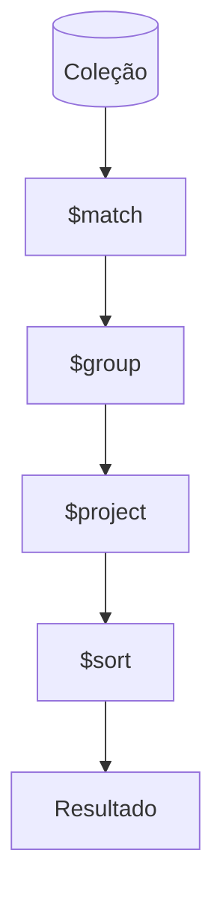

# Aula 14: Consultas Avançadas 🧪
## O Poder da Agregação
### Ricardo Pires
#### Bancos de Dados SQL e NoSQL

---

## 🎯 O que vamos aprender hoje?
- Aggregation Framework
- O conceito de Pipeline
- Estágios: $match, $group, $sort
- Projeção com $project
- Unindo Coleções com $lookup
- Performance de Consultas

---

## ⚙️ A Linha de Montagem
- Imagine uma fábrica.
- O dado bruto entra de um lado...
- Passa por várias máquinas (estágios)...
- Sai como um relatório pronto do outro! 🏭 <!-- .element: class="fragment" -->

---

## 🏗️ O Pipeline
```javascript
db.vendas.aggregate([
  { $match: { ano: 2024 } },
  { $group: { _id: "$produto", total: { $sum: "$qtd" } } }
]);
```
- Cada `{}` é uma estação de trabalho.

---

## 🎯 Estágio: $match
- É o filtro. Seleciona quem entra no pipeline.
- Semelhante ao `WHERE` do SQL. 🎯 <!-- .element: class="fragment" -->

---

## 🧱 Estágio: $group
- Agrupa documentos por um campo comum (`_id`).
- Realiza cálculos: `$sum`, `$avg`, `$max`, `$min`.
- O coração dos relatórios gerenciais! 📊 <!-- .element: class="fragment" -->

---

## 🎥 Estágio: $project
- Molda o documento final.
- `1` = Mostrar.
- `0` = Esconder.
- Útil para renomear campos ou remover o `_id`. <!-- .element: class="fragment" -->

---

## 📶 Estágio: $sort e $limit
- `$sort: { valor: -1 }` -> Do maior para o menor.
- `$limit: 5` -> Só os 5 primeiros.
- Essencial para rankings (Top 10). 🏆 <!-- .element: class="fragment" -->

---

## 🔗 Estágio: $lookup
- O "JOIN" do NoSQL. 🔗
- Busca dados em outra coleção e traz como um array aninhado.
- Ex: Trazer o nome do autor para dentro do post.

---

## 📊 Arquitetura da Agregação


---

## ⚡ Performance: Índices
- Agregações podem ser pesadas.
- Sempre crie índices nos campos usados no `$match`.
- `db.vendas.createIndex({ ano: 1 })` 🏎️ <!-- .element: class="fragment" -->

---

## 💻 Prática no Compass (Aggregations)
- O Compass tem um construtor de pipelines visual!
- Você vê o dado sendo transformado em tempo real em cada etapa. 😍 <!-- .element: class="fragment" -->

---

## 🚀 Desafio da Aula
- Crie um pipeline que mostre as 3 categorias de produtos mais caras (ticket médio) do seu banco.

---

## 🏁 Resumo
- Agregação processa dados em estágios.
- `$match` filtra, `$group` resume.
- `$lookup` une o que está separado.
- A ordem dos estágios importa muito!

---

## 👋 Até a próxima aula!
### Tema: Ecossistema Moderno e Deploy NoSQL 🚀
["Fazer Exercícios"](../exercicios/exercicio-14.md)